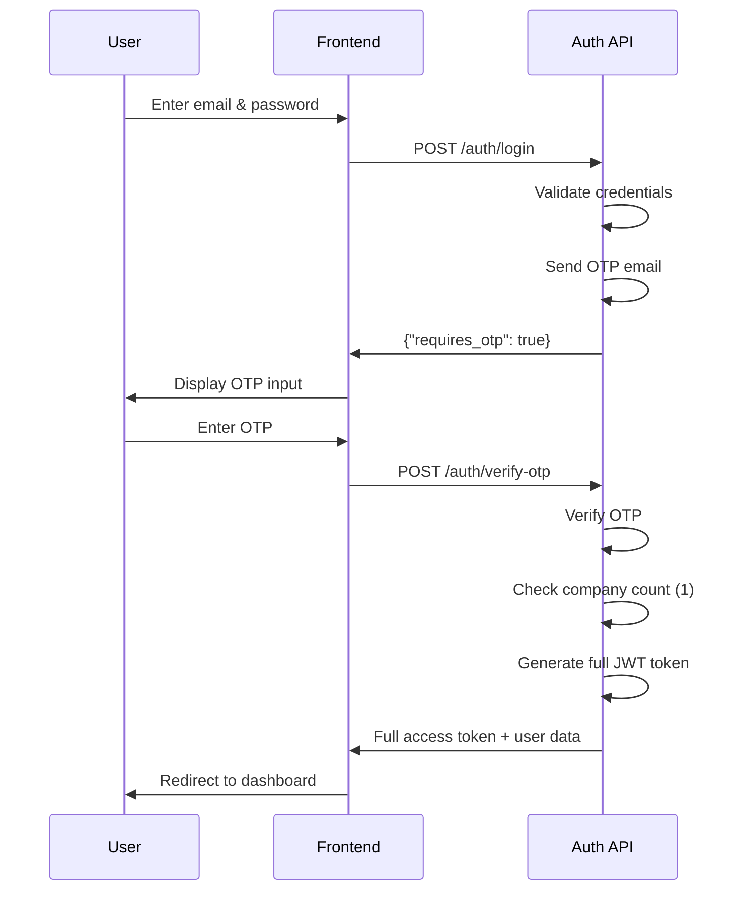
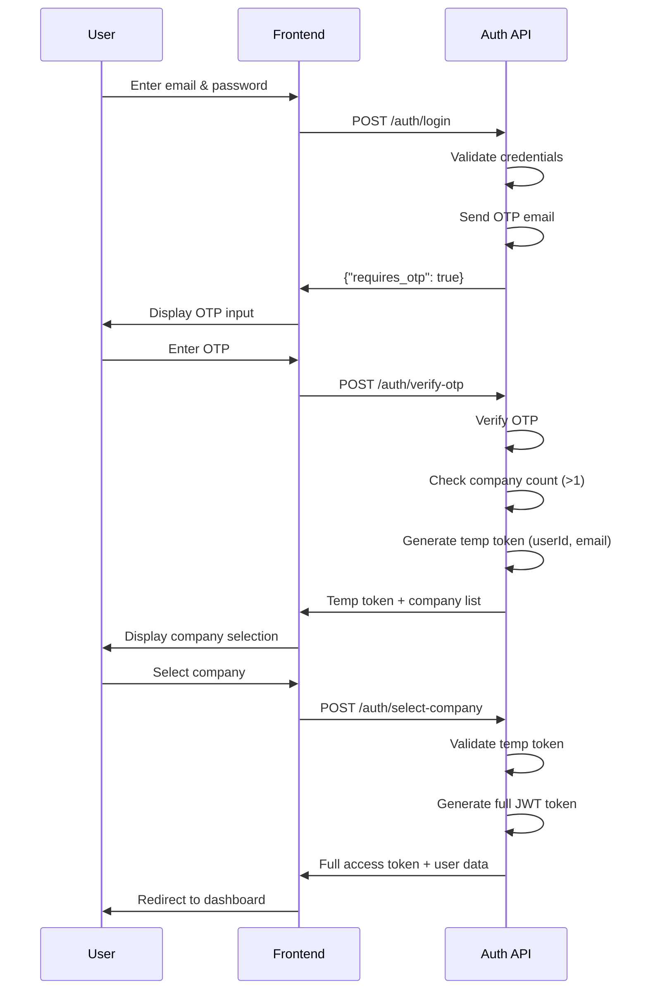

# WAVLET Authentication Flow

## Overview

The WAVLET API implements a comprehensive authentication system that supports both single-company and multi-company users. The system uses OTP (One-Time Password) verification and provides different flows based on whether a user belongs to one or multiple companies.

## Authentication Endpoints

### Core Endpoints

- `POST /auth/login` - Initiate login process
- `POST /auth/verify-otp` - Verify OTP and complete authentication
- `POST /auth/select-company` - Select company for multi-company users (new)
- `POST /auth/logout` - Logout user

### Utility Endpoints

- `POST /auth/check-email` - Check email existence across companies
- `POST /auth/login-with-company` - Login with specific company selection
- `POST /auth/forgot-password` - Request password reset
- `POST /auth/reset-password` - Reset password with token

## User Authentication Flows

### Flow 1: Single Company User

For users who belong to only one company, the authentication follows a straightforward 3-step process.



#### API Flow Details

1. **Login Request**

   ```http
   POST /auth/login
   Content-Type: application/json

   {
     "email": "user@company.com",
     "password": "SecurePass123!"
   }
   ```

2. **OTP Verification**

   ```http
   POST /auth/verify-otp
   Content-Type: application/json

   {
     "email": "user@company.com",
     "otp": "123456"
   }
   ```

3. **Success Response**
   ```json
   {
     "success": true,
     "message": "Login successful",
     "access_token": "eyJhbGciOiJIUzI1NiIsInR5cCI6IkpXVCJ9...",
     "user": {
       "id": "user-uuid",
       "email": "user@company.com",
       "first_name": "John",
       "last_name": "Doe",
       "company_id": "company-uuid",
       "role": "admin"
     },
     "company": {
       "id": "company-uuid",
       "name": "Company Name",
       "country": "Nigeria",
       "onboarding_is_completed": true
     },
     "redirect_to": "dashboard"
   }
   ```

### Flow 2: Multi-Company User

For users who belong to multiple companies, the authentication requires an additional company selection step.



#### API Flow Details

1. **Login Request** (Same as single company)

   ```http
   POST /auth/login
   Content-Type: application/json

   {
     "email": "user@company.com",
     "password": "SecurePass123!"
   }
   ```

2. **OTP Verification**

   ```http
   POST /auth/verify-otp
   Content-Type: application/json

   {
     "email": "user@company.com",
     "otp": "123456"
   }
   ```

3. **Multi-Company Response**

   ```json
   {
     "success": true,
     "message": "OTP verified. Please select a company to continue.",
     "temp_token": "eyJhbGciOiJIUzI1NiIsInR5cCI6IkpXVCJ9...",
     "requires_company_selection": true,
     "companies": [
       {
         "id": "company-uuid-1",
         "name": "Company A",
         "country": "Nigeria"
       },
       {
         "id": "company-uuid-2",
         "name": "Company B",
         "country": "Ghana"
       }
     ]
   }
   ```

4. **Company Selection**

   ```http
   POST /auth/select-company
   Content-Type: application/json

   {
     "temp_token": "eyJhbGciOiJIUzI1NiIsInR5cCI6IkpXVCJ9...",
     "company_id": "company-uuid-1"
   }
   ```

5. **Final Success Response**
   ```json
   {
     "success": true,
     "message": "Login successful",
     "access_token": "eyJhbGciOiJIUzI1NiIsInR5cCI6IkpXVCJ9...",
     "user": {
       "id": "user-uuid",
       "email": "user@company.com",
       "first_name": "John",
       "last_name": "Doe",
       "company_id": "company-uuid-1",
       "role": "admin"
     },
     "company": {
       "id": "company-uuid-1",
       "name": "Company A",
       "country": "Nigeria",
       "onboarding_is_completed": true
     },
     "redirect_to": "dashboard"
   }
   ```

## Token Structure

### Temporary Token (Multi-Company Flow)

- **Purpose**: Used only for company selection
- **Expires**: 15 minutes
- **Payload**:
  ```json
  {
    "sub": "user-uuid",
    "email": "user@company.com",
    "temp": true
  }
  ```

### Full Access Token

- **Purpose**: Complete authentication with company context
- **Expires**: 1 hour (configurable)
- **Payload**:
  ```json
  {
    "sub": "user-uuid",
    "email": "user@company.com",
    "companyId": "company-uuid",
    "roles": ["admin", "user"],
    "iat": 1638360000,
    "exp": 1638363600
  }
  ```

## Security Features

### OTP Security

- 6-digit numeric OTP
- Expires after 10 minutes
- Cleared after successful verification
- Rate limiting recommended

### Token Security

- JWT with HS256 algorithm
- Temporary tokens have short expiration (15 minutes)
- Full tokens include company context for authorization
- Token blacklist service for logout

### Password Security

- Bcrypt hashing with salt rounds
- Minimum 8 characters with complexity requirements
- Secure password reset flow

## Error Handling

### Common Error Scenarios

1. **Invalid Credentials**

   ```json
   {
     "statusCode": 401,
     "message": "Invalid credentials"
   }
   ```

2. **Expired OTP**

   ```json
   {
     "statusCode": 401,
     "message": "Invalid or expired OTP"
   }
   ```

3. **Invalid Temporary Token**

   ```json
   {
     "statusCode": 401,
     "message": "Invalid temporary token"
   }
   ```

4. **User Not in Company**
   ```json
   {
     "statusCode": 400,
     "message": "User not found in specified company"
   }
   ```

## Frontend Integration

### State Management

```javascript
// Authentication state
{
  isAuthenticated: false,
  user: null,
  company: null,
  tempToken: null,
  requiresCompanySelection: false,
  availableCompanies: []
}
```

### Flow Implementation

```javascript
// Single company flow
async function loginSingleCompany(email, password, otp) {
  await login({ email, password });
  const result = await verifyOtp({ email, otp });
  // result.access_token contains full token
  setAuthState(result);
}

// Multi-company flow
async function loginMultiCompany(email, password, otp, companyId) {
  await login({ email, password });
  const otpResult = await verifyOtp({ email, otp });
  // otpResult.temp_token contains temporary token
  // otpResult.companies contains available companies

  const finalResult = await selectCompany({
    temp_token: otpResult.temp_token,
    company_id: companyId,
  });
  // finalResult.access_token contains full token
  setAuthState(finalResult);
}
```

## Database Schema

### User Table

- `id` (UUID, Primary Key)
- `email` (String, Unique per company)
- `password` (String, Hashed)
- `company_id` (UUID, Foreign Key)
- `otp` (String, Nullable)
- `otp_expires` (DateTime, Nullable)
- Other user fields...

### Company Table

- `id` (UUID, Primary Key)
- `name` (String)
- `country` (String)
- Other company fields...

### UserCompanyRole Table

- `user_id` (UUID, Foreign Key)
- `company_id` (UUID, Foreign Key)
- `role_id` (UUID, Foreign Key)

## Migration Notes

### Backward Compatibility

- Existing single-company users continue working without changes
- No breaking changes to existing API endpoints
- New multi-company flow is additive

### Database Constraints

- Email unique per company: `[company_id, email]` compound index
- Foreign key relationships maintained
- No schema changes required for existing installations

## Testing Scenarios

### Single Company User

1. Login with valid credentials → OTP sent
2. Verify valid OTP → Full token returned
3. Access protected endpoints with token

### Multi-Company User

1. Login with valid credentials → OTP sent
2. Verify valid OTP → Temp token + company list returned
3. Select valid company → Full token returned
4. Select invalid company → Error returned

### Error Cases

1. Invalid credentials → 401 Unauthorized
2. Expired OTP → 401 Unauthorized
3. Invalid temp token → 401 Unauthorized
4. User not in selected company → 400 Bad Request

## Performance Considerations

### Database Queries

- Efficient user lookup by email across companies
- Company data fetched only when needed
- OTP validation with indexed queries

### Token Management

- Temporary tokens have short TTL (15 minutes)
- Full tokens cached appropriately
- Token blacklist for logout operations

### Rate Limiting

- Recommended: 5 login attempts per 15 minutes per IP
- Recommended: 3 OTP verification attempts per 10 minutes
- Recommended: 10 company selection attempts per 15 minutes

## Monitoring and Logging

### Key Metrics

- Authentication success/failure rates
- OTP delivery success rates
- Company selection patterns
- Token expiration rates

### Security Events

- Failed login attempts
- OTP verification failures
- Token validation errors
- Company selection anomalies

This authentication system provides a secure, scalable solution for both single and multi-tenant user management in the WAVLET platform.
