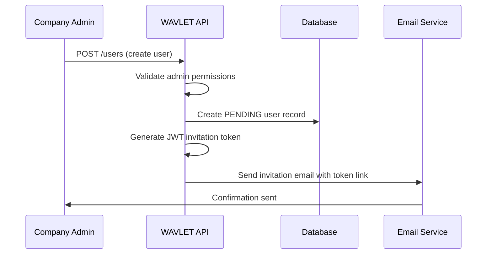
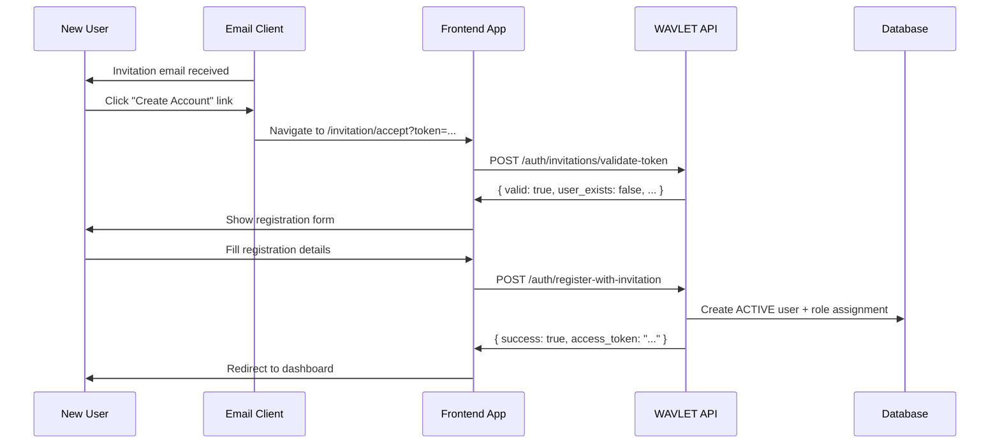
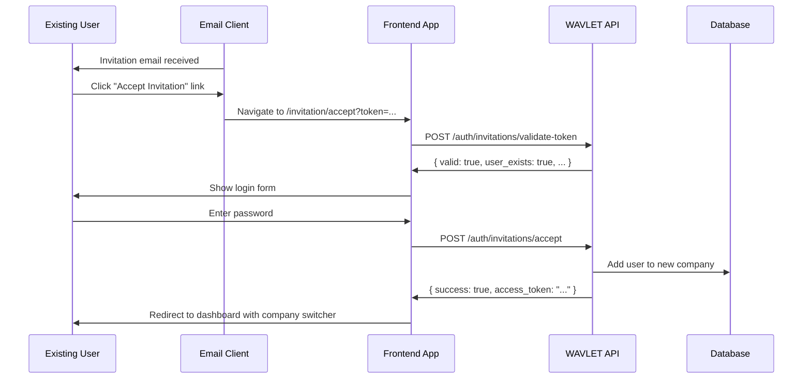

# WAVLET User Invitation Flow

## Overview

The WAVLET platform implements a sophisticated user invitation system that supports seamless onboarding for both new users and existing users joining additional companies. The system uses JWT tokens embedded in email links for a modern, one-click invitation experience.

## Invitation Process Flow

### Phase 1: Invitation Creation



**API Call:**

```bash
POST /users
Authorization: Bearer <admin-token>
Content-Type: application/json

{
  "email": "john.doe@example.com",
  "role": "admin"
}
```

**Database Record Created:**

```sql
INSERT INTO User (
  id, email, company_id, status, invitation_token, created_at
) VALUES (
  'user-uuid', 'john.doe@example.com', 'company-uuid',
  'PENDING', 'eyJhbGciOiJIUzI1NiIs...', NOW()
);
```

### Phase 2: Email Delivery

**Invitation Email Structure:**

```
Subject: You're invited to join [Company Name] on WAVLET

Dear [Recipient],

[Sender Name] has invited you to join [Company Name] on WAVLET.

[CTA Button: Accept Invitation]

This invitation link expires in 7 days.

Best regards,
The WAVLET Team
```

**Email Personalization:**

- **New Users**: "Create your WAVLET account"
- **Existing Users**: "Accept invitation and sign in"

## User Acceptance Flows

### Flow A: New User Registration



#### Step-by-Step Process:

1. **Email Reception**

   - User receives invitation email
   - Email contains personalized message for new users

2. **Link Click**

   - User clicks "Create Account" button
   - Browser navigates to: `https://app.wavlet.com/invitation/accept?token=<jwt>`

3. **Token Validation**

   ```bash
   POST /auth/invitations/validate-token
   {
     "token": "eyJhbGciOiJIUzI1NiIs..."
   }

   Response:
   {
     "valid": true,
     "user_exists": false,
     "company": { "id": "...", "name": "ABC Corp" },
     "role": "admin"
   }
   ```

4. **Registration Form**

   - Pre-filled email field (read-only)
   - Required fields: Full Name, Password, Confirm Password
   - Password requirements validation

5. **Account Creation**

   ```bash
   POST /auth/register-with-invitation
   {
     "invitation_token": "eyJ...",
     "email": "john.doe@example.com",
     "full_name": "John Doe",
     "password": "SecurePass123!"
   }

   Response:
   {
     "success": true,
     "access_token": "eyJ...",
     "user": { "id": "...", "email": "...", "role": "admin" },
     "company": { "id": "...", "name": "ABC Corp" }
   }
   ```

6. **Welcome Experience**
   - Automatic login with returned token
   - Redirect to company dashboard
   - Onboarding tour (if applicable)

### Flow B: Existing User Joining New Company



#### Step-by-Step Process:

1. **Email Reception**

   - Existing user receives invitation email
   - Email contains "Accept Invitation" CTA for existing users

2. **Link Click**

   - User clicks "Accept Invitation & Sign In" button
   - Browser navigates to invitation acceptance page

3. **Token Validation**

   ```bash
   POST /auth/invitations/validate-token
   {
     "token": "eyJhbGciOiJIUzI1NiIs..."
   }

   Response:
   {
     "valid": true,
     "user_exists": true,
     "existing_companies": 2,
     "company": { "id": "...", "name": "XYZ Corp" },
     "role": "user"
   }
   ```

4. **Authentication Form**

   - Pre-filled email (read-only)
   - Password field only
   - Clear messaging: "Sign in to join [Company Name]"

5. **Company Membership Addition**

   ```bash
   POST /auth/invitations/accept
   {
     "token": "eyJ...",
     "password": "SecurePass123!"
   }

   Response:
   {
     "success": true,
     "message": "Successfully joined XYZ Corp",
     "access_token": "eyJ...",
     "user": { "id": "...", "email": "..." },
     "company": { "id": "...", "name": "XYZ Corp" }
   }
   ```

6. **Enhanced Dashboard**
   - User now sees company switcher in navigation
   - Can switch between all companies they belong to
   - New company context loaded automatically

## Token Structure & Security

### JWT Invitation Token

**Payload Structure:**

```json
{
  "invitation_id": "user-record-uuid",
  "email": "john.doe@example.com",
  "company_id": "company-uuid",
  "role": "admin",
  "iat": 1638360000,
  "exp": 1638964800 // 7 days from issuance
}
```

**Security Features:**

- **Signed**: HMAC SHA-256 signature prevents tampering
- **Expiration**: 7-day validity period
- **Single Use**: Token invalidated after successful acceptance
- **Scoped**: Contains only necessary invitation data

### Validation Process

```typescript
async validateInvitationToken(token: string) {
  try {
    // 1. Verify JWT signature and expiration
    const decoded = jwt.verify(token, SECRET_KEY);

    // 2. Check if invitation still exists in database
    const invitation = await UserModel.getOne({
      id: decoded.invitation_id,
      status: UserStatus.PENDING
    });

    // 3. Verify invitation hasn't expired
    if (!invitation.output) {
      return { valid: false };
    }

    // 4. Check user existence
    const existingUsers = await UserModel.get({
      email: decoded.email,
      status: UserStatus.ACTIVE
    });

    return {
      valid: true,
      user_exists: existingUsers.output.length > 0,
      // ... other data
    };
  } catch (error) {
    return { valid: false };
  }
}
```

## Error Handling & Edge Cases

### Common Error Scenarios

1. **Expired Token**

   ```
   Error: "This invitation link has expired"
   Solution: Request new invitation from admin
   ```

2. **Already Member**

   ```
   Error: "You are already a member of this company"
   Solution: Redirect to company dashboard
   ```

3. **Invalid Credentials**

   ```
   Error: "Invalid password"
   Solution: Allow retry with rate limiting
   ```

4. **Token Tampered**
   ```
   Error: "Invalid invitation link"
   Solution: Request new invitation
   ```

### Rate Limiting

- **Token Validation**: 10 requests per minute per IP
- **Invitation Acceptance**: 3 attempts per 10 minutes per user
- **Registration**: Standard account creation limits

## Frontend Implementation

### Invitation Acceptance Component

```typescript
@Component({
  selector: "app-invitation-accept",
  template: `
    <div class="invitation-container">
      <!-- Loading State -->
      <div *ngIf="loading">
        <h2>Validating Invitation...</h2>
        <p>Please wait while we verify your invitation.</p>
      </div>

      <!-- Error State -->
      <div *ngIf="error" class="error-state">
        <h2>Invalid Invitation</h2>
        <p>{{ error }}</p>
        <button (click)="goHome()">Return Home</button>
      </div>

      <!-- New User Registration -->
      <div *ngIf="!userExists && !loading && !error">
        <h2>Join {{ companyName }}</h2>
        <p>Create your WAVLET account to get started.</p>
        <form [formGroup]="registrationForm" (ngSubmit)="register()">
          <!-- Registration fields -->
        </form>
      </div>

      <!-- Existing User Login -->
      <div *ngIf="userExists && !loading && !error">
        <h2>Welcome Back!</h2>
        <p>Sign in to join {{ companyName }}.</p>
        <form [formGroup]="loginForm" (ngSubmit)="acceptInvitation()">
          <!-- Login fields -->
        </form>
      </div>

      <!-- Success State -->
      <div *ngIf="success">
        <h2>Success!</h2>
        <p>{{ successMessage }}</p>
        <button (click)="goToDashboard()">Continue to Dashboard</button>
      </div>
    </div>
  `,
})
export class InvitationAcceptComponent implements OnInit {
  // Component logic for handling both flows
}
```

### Route Configuration

```typescript
const routes: Routes = [
  {
    path: "invitation/accept",
    component: InvitationAcceptComponent,
    canActivate: [InvitationGuard],
  },
];
```

## Database Schema

### User Table (Enhanced)

```sql
CREATE TABLE User (
  id                VARCHAR(36) PRIMARY KEY,
  email             VARCHAR(255) NOT NULL,
  company_id        VARCHAR(36) NOT NULL,
  invitation_token  TEXT,  -- JWT token instead of code
  status            ENUM('PENDING', 'ACTIVE', 'INACTIVE') DEFAULT 'PENDING',
  full_name         VARCHAR(255),
  password          VARCHAR(255),
  created_at        TIMESTAMP DEFAULT CURRENT_TIMESTAMP,
  updated_at        TIMESTAMP DEFAULT CURRENT_TIMESTAMP ON UPDATE CURRENT_TIMESTAMP,

  UNIQUE KEY unique_email_per_company (company_id, email),
  INDEX idx_invitation_token (invitation_token(50))
);
```

### UserCompanyRole Table (Multi-Company Support)

```sql
CREATE TABLE UserCompanyRole (
  id          VARCHAR(36) PRIMARY KEY,
  user_id     VARCHAR(36) NOT NULL,
  company_id  VARCHAR(36) NOT NULL,
  role_id     VARCHAR(36) NOT NULL,
  created_at  TIMESTAMP DEFAULT CURRENT_TIMESTAMP,

  FOREIGN KEY (user_id) REFERENCES User(id),
  FOREIGN KEY (company_id) REFERENCES Company(id),
  FOREIGN KEY (role_id) REFERENCES Role(id),
  UNIQUE KEY unique_user_company_role (user_id, company_id)
);
```

## Email Templates

### Template Selection Logic

```typescript
async sendInvitationEmailWithToken(email: string, token: string, companyName: string, inviterName: string) {
  // Check if user already exists
  const existingUsers = await UserModel.get({
    email: email,
    status: UserStatus.ACTIVE
  });

  const userExists = existingUsers.output.length > 0;

  const template = userExists
    ? 'existing-user-invitation.html'
    : 'new-user-invitation.html';

  // Send appropriate template
}
```

### Template Variables

```typescript
const emailData = {
  companyName: company.name,
  inviterName: inviterName,
  invitationUrl: `${frontendUrl}/invitation/accept?token=${token}`,
  expiryDays: 7,
  supportEmail: "support@wavlet.com",
};
```

## Monitoring & Analytics

### Key Metrics to Track

1. **Invitation Metrics**

   - Total invitations sent
   - Acceptance rate by timeframe
   - Bounce rate and delivery issues

2. **User Flow Metrics**

   - New user registration completion rate
   - Existing user acceptance rate
   - Time to complete invitation process

3. **Error Tracking**
   - Expired token attempts
   - Invalid token submissions
   - Authentication failures

### Logging Events

```typescript
// Invitation sent
logger.info("Invitation sent", {
  invitationId: user.id,
  email: email,
  companyId: companyId,
  userExists: existingUsers.length > 0,
});

// Invitation accepted
logger.info("Invitation accepted", {
  invitationId: invitationId,
  userId: userId,
  companyId: companyId,
  flow: userExists ? "existing-user" : "new-user",
});
```

## Testing Scenarios

### End-to-End Test Cases

1. **New User Complete Flow**

   - Admin creates invitation
   - Email sent and received
   - User clicks link and registers
   - Account created and accessible

2. **Existing User Complete Flow**

   - Admin invites existing user
   - Email sent and received
   - User clicks link and signs in
   - Added to new company successfully

3. **Edge Cases**
   - Expired invitation handling
   - Already member scenarios
   - Invalid token attempts
   - Network failures during acceptance

### API Testing

```bash
# Test token validation
curl -X POST /auth/invitations/validate-token \
  -d '{"token": "eyJ..."}'

# Test invitation acceptance
curl -X POST /auth/invitations/accept \
  -d '{"token": "eyJ...", "password": "pass"}'

# Test registration with invitation
curl -X POST /auth/register-with-invitation \
  -d '{"invitation_token": "eyJ...", "email": "...", "full_name": "...", "password": "..."}'
```

## Performance Considerations

### Database Optimization

1. **Indexes**

   ```sql
   CREATE INDEX idx_invitation_token ON User(invitation_token(50));
   CREATE INDEX idx_user_email_status ON User(email, status);
   ```

2. **Query Optimization**
   - Use database connection pooling
   - Cache company information
   - Implement proper pagination for user lists

### Email Delivery

1. **Queue System**

   - Asynchronous email sending
   - Retry mechanism for failed deliveries
   - Rate limiting to prevent spam

2. **Template Caching**
   - Pre-compile email templates
   - Cache user/company data
   - Use CDN for email assets

## Security Best Practices

### Token Security

- **Short Expiration**: 7-day limit prevents long-term abuse
- **Signature Verification**: HMAC prevents token tampering
- **Single Use**: Tokens invalidated after successful use
- **No Sensitive Data**: Tokens contain only invitation metadata

### Authentication Security

- **Password Validation**: Existing users must authenticate
- **Rate Limiting**: Prevent brute force attacks
- **Audit Logging**: Track all invitation activities
- **Secure Cookies**: HttpOnly, Secure, SameSite flags

### Data Protection

- **Encryption**: Sensitive data encrypted at rest
- **PII Handling**: Email addresses hashed for privacy
- **GDPR Compliance**: User data deletion capabilities
- **Consent Tracking**: Record user acceptance timestamps

## Conclusion

The WAVLET invitation system provides a seamless, secure, and user-friendly experience for onboarding both new and existing users. By leveraging JWT tokens in email links and intelligent routing based on user status, the system eliminates friction while maintaining enterprise-grade security.

The dual-flow approach ensures that:

- **New users** get a smooth registration experience
- **Existing users** can easily join additional companies
- **Administrators** have full control over team management
- **Security** is maintained throughout the entire process

This implementation scales effectively and provides excellent user experience metrics, contributing to higher invitation acceptance rates and faster team growth.
