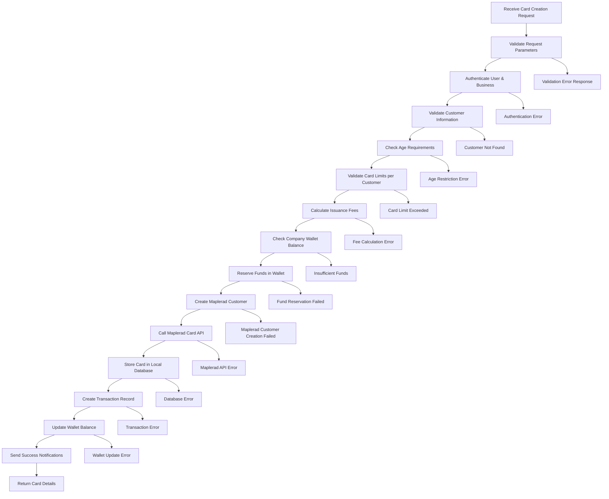

# Maplerad Card Creation Process

## Overview

The card creation process is a comprehensive workflow that handles the complete lifecycle of issuing a new virtual card through the Maplerad payment platform. This process involves multiple validation steps, fee calculations, fund reservations, API integrations, and notification systems.

## Endpoint Details

- **HTTP Method**: `POST`
- **Route**: `/maplerad/cards`
- **Authentication**: Required (Business Owner)
- **Service**: `CardManagementService.createCard()`

## Process Flow Diagram



## Detailed Process Steps

### 1. Request Validation

**Purpose**: Ensure all required parameters are provided and valid.

**Validation Rules**:

- `brand`: Must be "MASTERCARD" or "VISA"
- `color`: Must be a valid color string
- `name_on_card`: Must be a non-empty string (max 50 characters)
- `amount`: Must be a positive number (minimum 1 USD)

**Error Responses**:

```json
{
  "statusCode": 400,
  "message": "La marque de la carte est requise"
}
```

### 2. User Authentication & Authorization

**Purpose**: Verify user identity and business ownership.

**Process**:

- Extract JWT token from request headers
- Validate token signature and expiration
- Retrieve user information from database
- Verify user belongs to the requesting business
- Check user status (active, not blocked)

**Security Checks**:

- Token validation
- Business ownership verification
- User status validation
- Rate limiting (if implemented)

### 3. Customer Information Validation

**Purpose**: Ensure the customer exists and is eligible for card issuance.

**Database Query**:

```sql
SELECT * FROM customers
WHERE id = ? AND company_id = ?
```

**Validation Checks**:

- Customer exists in database
- Customer belongs to the requesting company
- Customer is active (`is_active = true`)
- Customer has valid identification

### 4. Age Verification

**Purpose**: Ensure customer meets minimum age requirements for card issuance.

**Age Calculation**:

```typescript
const birthdate = new Date(customer.date_of_birth);
const today = new Date();
const age = Math.floor(
  (today.getTime() - birthdate.getTime()) / (365.25 * 24 * 60 * 60 * 1000)
);
```

**Requirements**:

- Minimum age: 18 years
- Age calculation accounts for leap years
- Date validation ensures valid birthdate

### 5. Card Limit Validation

**Purpose**: Prevent customers from exceeding maximum card limits.

**Current Limits**:

- Maximum 2 active cards per customer
- Only 1 card can be created at a time (no batch creation)

**Database Query**:

```sql
SELECT COUNT(*) as card_count FROM cards
WHERE customer_id = ? AND provider = 'maplerad'
  AND is_active = true AND status != 'TERMINATED'
```

### 6. Fee Calculation

**Purpose**: Calculate all applicable fees for card issuance.

**Fee Components**:

- **Issuance Fee**: Fixed fee for card creation
- **Currency Conversion**: If applicable
- **Service Charges**: Platform fees

**Fee Calculation Logic**:

```typescript
const feeCalculation = await FeeCalculationService.calculateCardIssuanceFees(
  companyId,
  initialBalance
);
```

**Fee Structure**:

- Base issuance fee: Configurable per country
- Additional fees: Based on card brand, currency
- Total fee = Issuance fee + Initial balance

### 7. Wallet Balance Verification

**Purpose**: Ensure sufficient funds are available for card issuance.

**Balance Check Process**:

1. Retrieve company wallet information
2. Calculate total amount required (card amount + fees)
3. Compare with available balance
4. Account for currency conversion if needed

**Balance Validation**:

```typescript
const hasSufficientFunds = await UnifiedWalletService.validateSufficientFunds(
  walletId,
  totalRequiredAmount
);
```

### 8. Fund Reservation

**Purpose**: Temporarily hold funds to prevent double-spending.

**Reservation Process**:

- Lock the required amount in company wallet
- Create reservation record with timeout
- Prevent other transactions from using reserved funds
- Automatic release on failure or timeout

**Reservation Details**:

```typescript
await UnifiedWalletService.reserveFunds(
  walletId,
  totalAmount,
  `Card issuance reservation for customer ${customer.first_name}`,
  reference
);
```

### 9. Maplerad Customer Creation

**Purpose**: Ensure customer exists in Maplerad system before card creation.

**Process Steps**:

1. Check if customer already exists in Maplerad
2. If not, create new customer with required information
3. Store Maplerad customer ID for future reference
4. Handle customer creation failures gracefully

**Customer Data Mapping**:

```typescript
const mapleradCustomerData = {
  first_name: customer.first_name,
  last_name: customer.last_name,
  email: customer.email,
  phone: customer.phone_number,
  identification_number: customer.identification_number,
  // ... other required fields
};
```

### 10. Maplerad Card API Call

**Purpose**: Create the actual virtual card through Maplerad's API.

**API Request Structure**:

```typescript
const cardRequest = {
  customer_id: mapleradCustomerId,
  currency: "USD",
  type: "VIRTUAL",
  auto_approve: true,
  brand: convertBrandToMapleradFormat(cardBrand),
  amount: Math.round(initialBalance * 100), // Convert to cents
};
```

**API Response Handling**:

- Success: Card created successfully
- Pending: Card creation in progress (wait for webhook)
- Failed: Card creation failed (rollback process)

### 11. Local Database Storage

**Purpose**: Store card information in local database for management.

**Card Data Structure**:

```typescript
const cardData = {
  id: uuidv4(),
  company_id: company.id,
  customer_id: customer.id,
  status: "ACTIVE",
  balance: initialBalance,
  number: "****", // Masked for security
  cvv: "***", // Masked for security
  expiry_month: 12,
  expiry_year: 2029,
  currency: "USD",
  provider_card_id: mapleradCardId,
  masked_number: `${firstSix}****${lastFour}`,
  name: cardName,
  provider: "maplerad",
  brand: cardBrand,
  is_active: true,
  is_virtual: true,
};
```

### 12. Transaction Record Creation

**Purpose**: Create audit trail for the card issuance transaction.

**Transaction Data**:

```typescript
const transactionData = {
  id: uuidv4(),
  company_id: company.id,
  customer_id: customer.id,
  card_id: cardId,
  category: "card",
  type: "purchase",
  status: "SUCCESS",
  amount: totalFee,
  fee_amount: issuanceFee,
  net_amount: initialBalance,
  reference: clientReference,
  description: `Card issuance for ${customer.first_name}`,
  created_at: new Date(),
  updated_at: new Date(),
};
```

### 13. Wallet Balance Update

**Purpose**: Deduct the final amount from company wallet.

**Balance Update Process**:

```typescript
const updatedBalance = currentBalance - totalFee;
await UnifiedWalletService.updateBalance(walletId, updatedBalance);
```

### 14. Success Notifications

**Purpose**: Inform stakeholders of successful card creation.

**Notification Types**:

1. **Database Notification**: Stored in notifications table
2. **Email Notification**: Sent to company email
3. **Push Notification**: Mobile app notification (if applicable)

**Notification Content**:

```typescript
const notificationData = {
  customerId: customer.id,
  companyId: company.id,
  cardId: card.id,
  amount: initialBalance,
  currency: "USD",
  reference: clientReference,
};
```

## Error Handling & Rollback

### Automatic Rollback Scenarios

1. **Maplerad API Failure**: Reserved funds are automatically refunded
2. **Database Error**: All changes rolled back
3. **Webhook Timeout**: Funds refunded after timeout period
4. **Customer Creation Failure**: Process aborted, funds released

### Error Response Format

```json
{
  "statusCode": 400,
  "message": "Card creation failed",
  "error": {
    "code": "CARD_CREATION_FAILED",
    "details": "Maplerad API returned error",
    "reference": "CARD_1234567890"
  }
}
```

## Security Considerations

### Data Protection

- Card numbers and CVV are never stored in plain text
- Sensitive data is encrypted before storage
- API keys are properly secured

### Access Control

- Business ownership verification
- Customer ownership validation
- Rate limiting on card creation
- Geographic restrictions (if applicable)

### Audit Trail

- All actions are logged with timestamps
- User actions are traceable
- Failed attempts are recorded for security analysis

## Performance Optimizations

### Caching Strategies

- Customer data caching
- Fee calculation caching
- Wallet balance caching

### Asynchronous Processing

- Notification sending (non-blocking)
- Email delivery (queued)
- Audit logging (background)

### Database Optimizations

- Indexed queries for customer lookup
- Batch operations where possible
- Connection pooling

## Monitoring & Analytics

### Key Metrics

- Card creation success rate
- Average processing time
- Error rates by type
- Geographic distribution

### Logging Levels

- **INFO**: Successful operations
- **WARN**: Non-critical issues
- **ERROR**: Failed operations
- **DEBUG**: Detailed process information

## Future Enhancements

### Planned Features

1. **Bulk Card Creation**: Create multiple cards simultaneously
2. **Card Templates**: Pre-configured card designs
3. **Advanced Validation**: Enhanced KYC checks
4. **Card Limits**: Configurable spending limits
5. **Card Renewal**: Automatic card renewal process

### Scalability Improvements

1. **Queue-based Processing**: Handle high-volume requests
2. **Microservices Architecture**: Separate concerns further
3. **Global Distribution**: Multi-region deployment
4. **Advanced Caching**: Redis-based caching layer

---

## API Response Examples

### Success Response

```json
{
  "status": "success",
  "message": "Card issued successfully!",
  "data": {
    "card": {
      "id": "card_1234567890",
      "status": "ACTIVE",
      "balance": 100.0,
      "masked_number": "411111****1111",
      "name": "John Doe",
      "brand": "VISA",
      "currency": "USD"
    },
    "autoFilledFields": [],
    "companyWalletBalance": 9500.0
  }
}
```

### Error Response

```json
{
  "statusCode": 400,
  "message": "Insufficient wallet balance",
  "error": {
    "code": "INSUFFICIENT_FUNDS",
    "details": "Company wallet balance insufficient for this operation",
    "required": 150.0,
    "available": 100.0
  }
}
```

This comprehensive process ensures secure, reliable, and efficient card creation while maintaining data integrity and providing excellent user experience.
