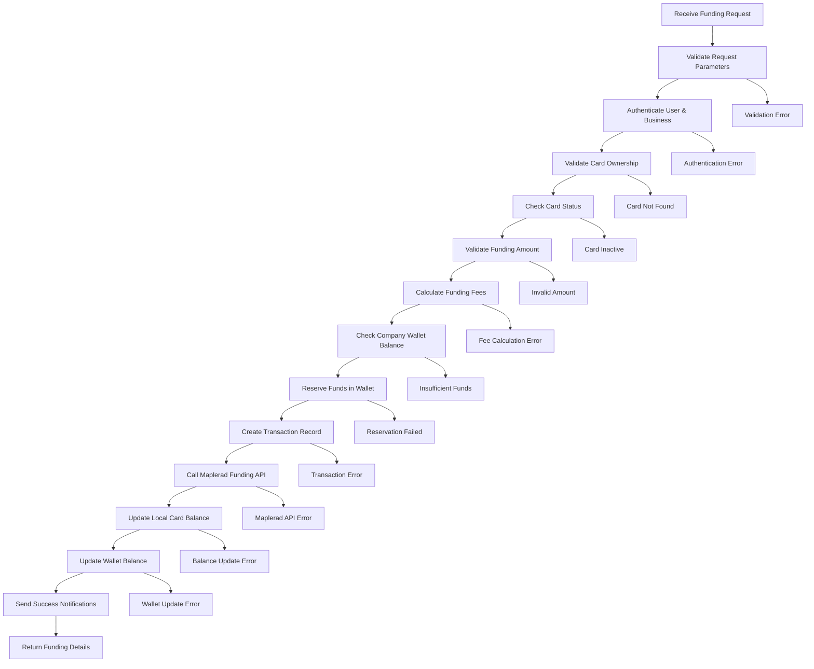

# Maplerad Card Funding Process

## Overview

The card funding process enables customers to add money to their virtual cards. This process involves balance validation, fee calculation, fund transfer from company wallet to card, and synchronization with Maplerad's systems. The process ensures secure fund transfers while maintaining accurate balance tracking.

## Endpoint Details

- **HTTP Method**: `POST`
- **Route**: `/maplerad/cards/:cardId/fund`
- **Authentication**: Required (Business Owner)
- **Service**: `CardTransactionService.fundCard()`

## Process Flow Diagram



## Detailed Process Steps

### 1. Request Validation

**Purpose**: Ensure funding request parameters are valid and complete.

**Validation Rules**:

- `cardId`: Must be a valid UUID and exist in database
- `amount`: Must be a positive number (1-50 USD)
- Card must belong to authenticated business
- Card must be active and not terminated

**Parameter Validation**:

```typescript
if (!cardId || !amount || amount < 1 || amount > 50) {
  throw new Error("Invalid funding parameters");
}
```

### 2. User Authentication & Business Verification

**Purpose**: Ensure only authorized business owners can fund cards.

**Authentication Process**:

- JWT token validation
- User existence and status check
- Business ownership verification
- Card ownership validation (card belongs to business customer)

**Security Checks**:

```typescript
// Verify business owns the card's customer
const card = await CardModel.getOne({ id: cardId });
if (card.customer.company_id !== business.id) {
  throw new Error("Unauthorized access to card");
}
```

### 3. Card Validation

**Purpose**: Ensure the card is eligible for funding.

**Card Status Checks**:

- Card exists in database
- Card belongs to requesting business
- Card is active (`status = 'ACTIVE'`)
- Card is not frozen or terminated
- Card provider is Maplerad

**Card Validation Logic**:

```typescript
const cardResult = await CardModel.getOne({ id: cardId });
if (!cardResult.output) {
  throw new Error("Card not found");
}

const card = cardResult.output;
if (card.status !== "ACTIVE" || card.provider !== "maplerad") {
  throw new Error("Card not eligible for funding");
}
```

### 4. Amount Validation

**Purpose**: Ensure funding amount meets business rules.

**Amount Limits**:

- Minimum: 1 USD
- Maximum: 50 USD (configurable)
- Must be positive number
- No decimal restrictions for USD

**Business Rules**:

```typescript
const MIN_AMOUNT = 1;
const MAX_AMOUNT = 50;

if (amount < MIN_AMOUNT) {
  throw new Error(`Minimum funding amount is ${MIN_AMOUNT} USD`);
}

if (amount > MAX_AMOUNT) {
  throw new Error(`Maximum funding amount is ${MAX_AMOUNT} USD`);
}
```

### 5. Fee Calculation

**Purpose**: Calculate all applicable fees for the funding transaction.

**Fee Components**:

- **Funding Fee**: Percentage-based fee on transaction amount
- **Fixed Fee**: Additional fixed charge (if applicable)
- **Currency Conversion**: If wallet currency differs from USD

**Fee Calculation Process**:

```typescript
const feeCalculation = await FeeCalculationService.calculateCardTopupFees(
  card.id,
  amount,
  "USD",
  customer.country_iso_code
);
```

**Fee Structure**:

- Base funding fee: Configurable percentage (e.g., 2.5%)
- Additional fees: Based on amount ranges
- Total cost = Funding amount + Fee

### 6. Wallet Balance Verification

**Purpose**: Ensure company has sufficient funds for the transaction.

**Balance Check Process**:

1. Retrieve company wallet information
2. Calculate total amount needed (funding + fees)
3. Verify available balance
4. Account for any pending reservations

**Balance Validation**:

```typescript
const totalRequired = amount + feeCalculation.totalFee;
const hasBalance = await UnifiedWalletService.validateSufficientFunds(
  walletId,
  totalRequired
);

if (!hasBalance) {
  throw new Error("Insufficient wallet balance");
}
```

### 7. Fund Reservation

**Purpose**: Temporarily lock funds to prevent double-spending.

**Reservation Process**:

- Reserve exact amount needed (funding + fees)
- Create reservation record with transaction ID
- Set automatic timeout for reservation release
- Update wallet available balance

**Reservation Implementation**:

```typescript
await UnifiedWalletService.reserveFunds(
  walletId,
  totalRequired,
  `Card funding reservation: ${amount} USD`,
  transactionId
);
```

### 8. Transaction Record Creation

**Purpose**: Create audit trail before API call for tracking and rollback.

**Transaction Data Structure**:

```typescript
const transactionData = {
  id: transactionId,
  status: "PENDING",
  amount: amount,
  fee_amount: feeCalculation.totalFee,
  category: "card",
  type: "topup",
  customer_id: card.customer_id,
  card_id: cardId,
  company_id: business.id,
  provider: "maplerad",
  currency: "USD",
  reference: `FUND_${Date.now()}`,
  description: `Fund card ${card.masked_number}`,
  created_at: new Date(),
};
```

**Transaction States**:

- `PENDING`: Initial state, funds reserved
- `SUCCESS`: Transaction completed successfully
- `FAILED`: Transaction failed, funds refunded

### 9. Maplerad Funding API Call

**Purpose**: Transfer funds to the card through Maplerad's API.

**API Request Structure**:

```typescript
const fundingRequest = {
  card_id: card.provider_card_id,
  amount: Math.round(amount * 100), // Convert to cents
  currency: "USD",
  reference: transactionId,
};
```

**API Response Handling**:

- **Success**: Funds transferred, card balance updated
- **Pending**: Transaction in progress, wait for webhook
- **Failed**: Transaction failed, rollback local changes

**Error Handling**:

```typescript
try {
  const response = await mapleradUtils.fundCard(fundingRequest);
  if (response.error) {
    throw new Error("Maplerad funding failed");
  }
} catch (error) {
  // Rollback: Release reserved funds
  await UnifiedWalletService.refundFunds(
    walletId,
    totalRequired,
    transactionId
  );
  await TransactionModel.update(transactionId, { status: "FAILED" });
  throw error;
}
```

### 10. Local Balance Updates

**Purpose**: Update card balance in local database.

**Balance Update Process**:

```typescript
const newBalance = card.balance + amount;
await CardModel.update(cardId, {
  balance: newBalance,
  updated_at: new Date(),
});
```

**Balance Tracking**:

- Previous balance recorded
- New balance calculated
- Update timestamp recorded
- Balance change logged

### 11. Wallet Balance Deduction

**Purpose**: Deduct the final amount from company wallet.

**Wallet Update Process**:

```typescript
const finalAmount = amount + feeCalculation.totalFee;
await UnifiedWalletService.updateBalance(walletId, finalAmount);
```

**Balance Reconciliation**:

- Reserved amount released
- Final amount deducted
- Wallet balance updated
- Transaction completed

### 12. Transaction Status Update

**Purpose**: Mark transaction as completed in audit trail.

**Status Update**:

```typescript
await TransactionModel.update(transactionId, {
  status: "SUCCESS",
  order_id: mapleradReference,
  card_new_balance_usd: newCardBalance,
  updated_at: new Date(),
});
```

### 13. Success Notifications

**Purpose**: Inform stakeholders of successful funding.

**Notification Types**:

1. **Database Notification**: Stored for customer
2. **Email Notification**: Sent to company
3. **Push Notification**: Mobile notification (if enabled)

**Notification Content**:

```typescript
const notificationData = {
  customerId: card.customer_id,
  companyId: business.id,
  cardId: cardId,
  amount: amount,
  currency: "USD",
  reference: transactionId,
  message: `Card funded with ${amount} USD`,
};
```

## Error Handling & Recovery

### Automatic Recovery Scenarios

1. **Maplerad API Failure**:

   - Reserved funds automatically refunded
   - Transaction marked as failed
   - Customer notified of failure

2. **Database Error**:

   - Transaction rolled back
   - Funds reservation released
   - Error logged for investigation

3. **Timeout Scenarios**:
   - Webhook timeout handling
   - Automatic fund refund
   - Status update to failed

### Error Response Format

```json
{
  "statusCode": 400,
  "message": "Card funding failed",
  "error": {
    "code": "FUNDING_FAILED",
    "details": "Maplerad API returned error",
    "reference": "FUND_1234567890"
  }
}
```

## Security Considerations

### Fund Protection

- **Reservation System**: Prevents double-spending
- **Timeout Protection**: Automatic fund release
- **Audit Trail**: Complete transaction logging
- **Balance Validation**: Real-time balance checks

### Access Control

- **Business Verification**: Only business owners can fund cards
- **Card Ownership**: Cards can only be funded by owning business
- **Amount Limits**: Configurable limits prevent abuse
- **Rate Limiting**: API rate limiting on funding requests

### Data Integrity

- **Atomic Operations**: All-or-nothing transaction approach
- **Balance Consistency**: Wallet and card balances always reconciled
- **Transaction Logging**: Complete audit trail for all operations

## Performance Optimizations

### Caching Strategies

- **Fee Calculation Caching**: Cache fee structures
- **Balance Caching**: Cache wallet balances
- **Card Data Caching**: Cache card information

### Asynchronous Processing

- **Notification Queue**: Non-blocking notifications
- **Email Queue**: Background email processing
- **Webhook Handling**: Asynchronous webhook processing

### Database Optimizations

- **Indexed Queries**: Fast card and customer lookups
- **Batch Updates**: Efficient balance updates
- **Connection Pooling**: Optimized database connections

## Monitoring & Analytics

### Key Metrics

- **Funding Success Rate**: Percentage of successful funding transactions
- **Average Processing Time**: Time from request to completion
- **Error Rate by Type**: Breakdown of failure reasons
- **Funding Volume**: Total amount funded over time

### Business Intelligence

- **Popular Funding Amounts**: Most common funding amounts
- **Geographic Distribution**: Funding patterns by region
- **Time-based Patterns**: Peak funding hours/days
- **Customer Segmentation**: Funding behavior by customer type

## Business Rules & Compliance

### Funding Limits

- **Daily Limits**: Maximum funding per day per card
- **Monthly Limits**: Maximum funding per month per customer
- **Velocity Checks**: Rate limiting on funding frequency
- **Risk Assessment**: Automated risk scoring

### Regulatory Compliance

- **AML Checks**: Anti-money laundering validation
- **Transaction Monitoring**: Suspicious activity detection
- **Reporting Requirements**: Regulatory reporting compliance
- **Audit Requirements**: Complete transaction audit trails

## Future Enhancements

### Planned Features

1. **Bulk Funding**: Fund multiple cards simultaneously
2. **Scheduled Funding**: Automated recurring funding
3. **Funding Templates**: Pre-configured funding amounts
4. **Advanced Analytics**: Detailed funding insights

### Technical Improvements

1. **Real-time Processing**: Instant funding confirmation
2. **Enhanced Security**: Multi-factor authentication
3. **Mobile Optimization**: Improved mobile experience
4. **API Rate Limiting**: Advanced rate limiting

---

## API Response Examples

### Success Response

```json
{
  "status": "success",
  "message": "Card funded with 25 USD",
  "data": {
    "transactionId": "txn_1234567890",
    "amount": 25,
    "fee": 0.625,
    "totalCharged": 25.625,
    "cardBalance": 125,
    "reference": "FUND_1234567890"
  }
}
```

### Error Response

```json
{
  "statusCode": 400,
  "message": "Insufficient wallet balance",
  "error": {
    "code": "INSUFFICIENT_FUNDS",
    "details": "Company wallet balance insufficient",
    "required": 25.625,
    "available": 20
  }
}
```

### Webhook Response

```json
{
  "event": "issuing.transaction",
  "type": "FUNDING",
  "card_id": "card_12345",
  "amount": 2500,
  "currency": "USD",
  "status": "SUCCESS",
  "reference": "txn_1234567890"
}
```

This comprehensive funding process ensures secure, efficient, and reliable card funding while maintaining complete audit trails and regulatory compliance.
