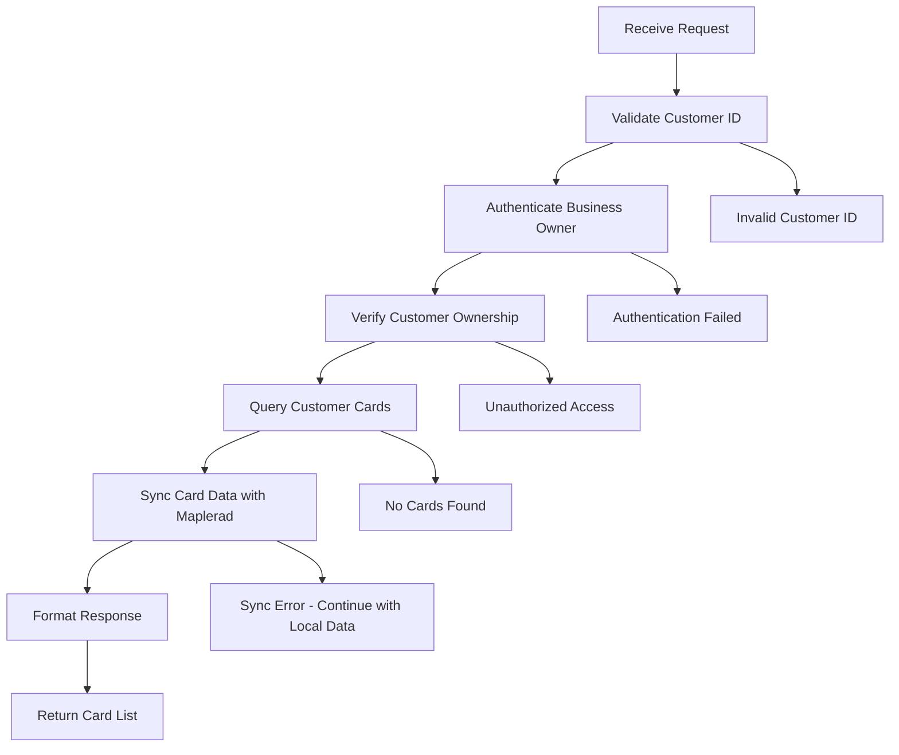
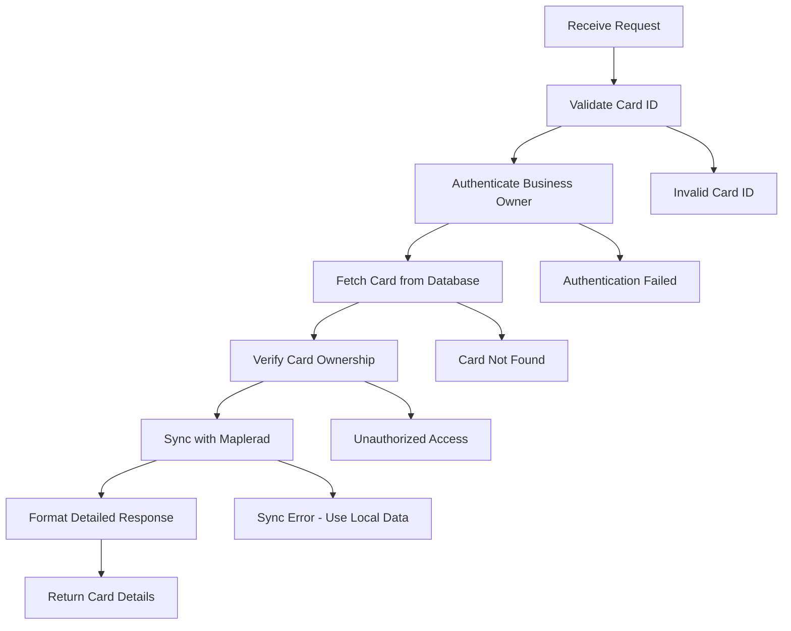
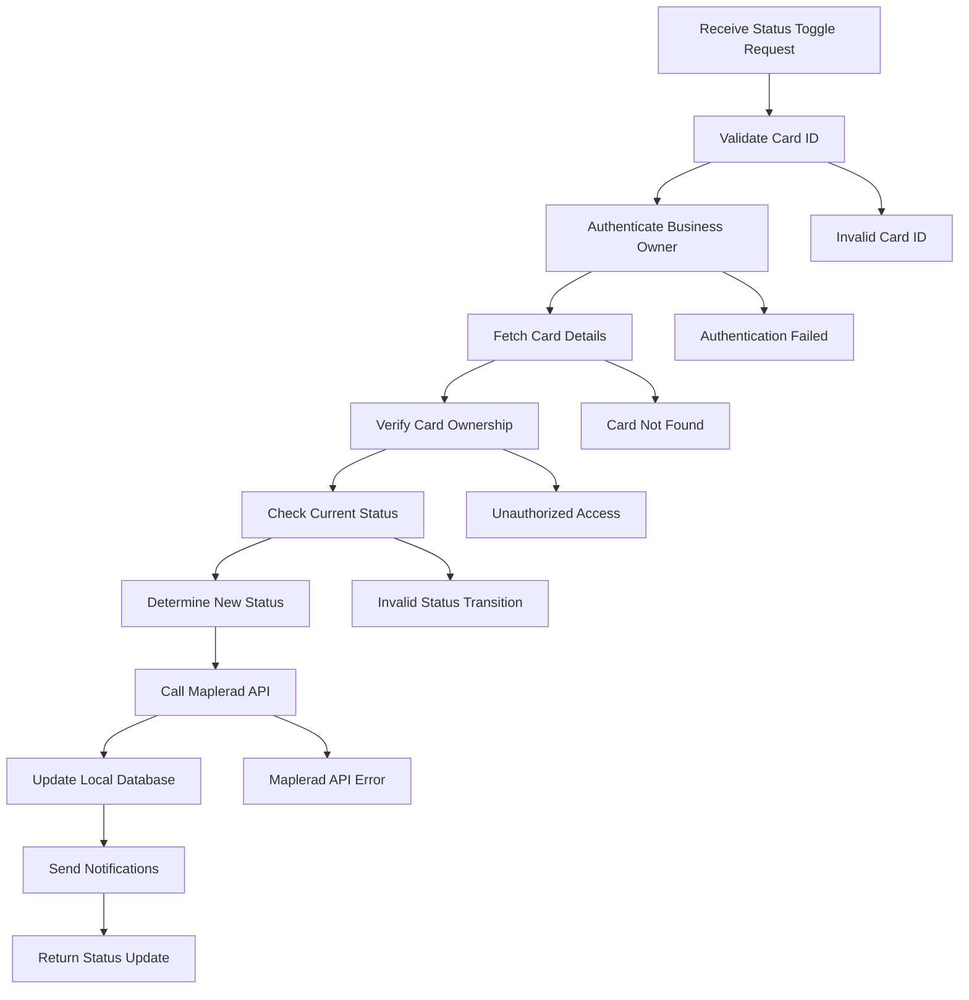
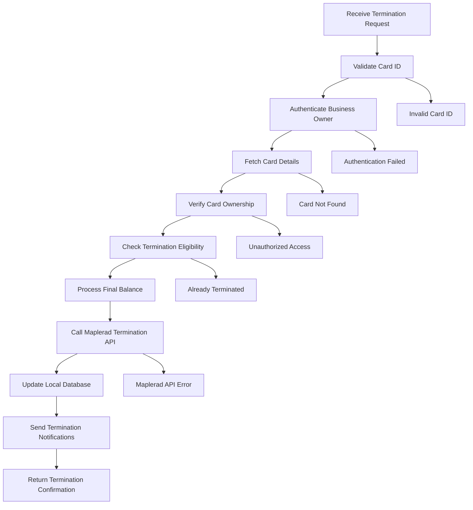
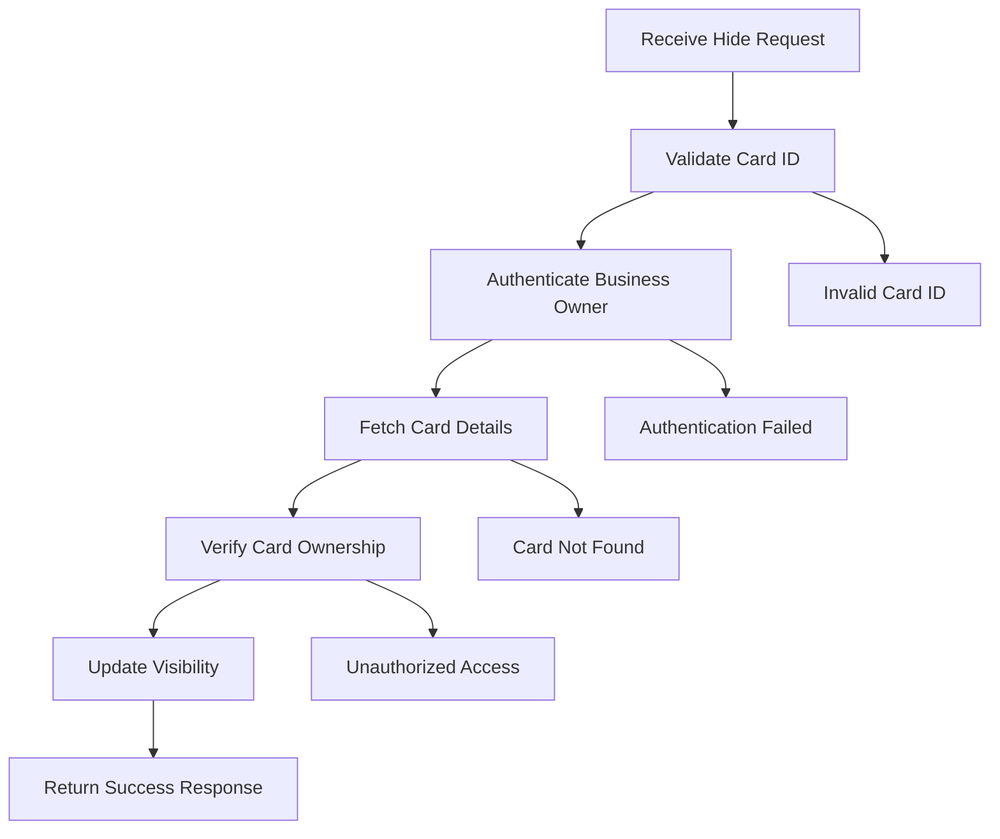

# Maplerad Card Management Endpoints

## Overview

The card management endpoints provide comprehensive functionality for managing virtual cards throughout their lifecycle. These endpoints handle card retrieval, status management, termination, and other administrative operations while ensuring proper authorization and security controls.

## Endpoints Summary

| Endpoint                               | Method | Purpose                   | Authentication |
| -------------------------------------- | ------ | ------------------------- | -------------- |
| `/maplerad/cards/customer/:customerId` | GET    | Get all customer cards    | Business Owner |
| `/maplerad/cards/:cardId`              | GET    | Get specific card details | Business Owner |
| `/maplerad/cards/:cardId/status`       | PATCH  | Toggle card status        | Business Owner |
| `/maplerad/cards/:cardId/terminate`    | DELETE | Terminate card            | Business Owner |
| `/maplerad/cards/:cardId/hide`         | PATCH  | Hide card from list       | Business Owner |

---

## 1. Get Customer Cards Endpoint

### Endpoint Details

- **HTTP Method**: `GET`
- **Route**: `/maplerad/cards/customer/:customerId`
- **Authentication**: Required (Business Owner)
- **Service**: `CardManagementService.getCustomerCardsWithSync()`

### Process Flow



### Detailed Process Steps

#### 1. Parameter Validation

**Purpose**: Ensure customer ID is valid and properly formatted.

**Validation Rules**:

```typescript
if (!customerId || !isValidUUID(customerId)) {
  throw new Error("Invalid customer ID format");
}
```

#### 2. Business Authorization

**Purpose**: Verify requesting user owns the customer's business.

**Authorization Logic**:

```typescript
// Get customer to verify business ownership
const customer = await CustomerModel.getOne({ id: customerId });
if (!customer || customer.company_id !== businessId) {
  throw new Error("Unauthorized access to customer cards");
}
```

#### 3. Card Retrieval

**Purpose**: Fetch all active Maplerad cards for the customer.

**Database Query**:

```sql
SELECT * FROM cards
WHERE customer_id = ? AND provider = 'maplerad'
  AND is_active = true AND status != 'TERMINATED'
ORDER BY created_at DESC
```

**Query Optimization**:

- Indexed on `customer_id` and `provider`
- Filtered for active cards only
- Sorted by creation date (newest first)

#### 4. Data Synchronization

**Purpose**: Ensure card data is current with Maplerad's system.

**Sync Process**:

```typescript
for (const card of localCards) {
  try {
    // Fetch latest data from Maplerad
    const mapleradData = await mapleradUtils.getCardDetails(
      card.provider_card_id
    );

    // Update local balance and status if changed
    if (mapleradData.balance !== card.balance) {
      await CardModel.update(card.id, {
        balance: mapleradData.balance,
        status: mapleradData.status,
        updated_at: new Date(),
      });
    }
  } catch (syncError) {
    console.warn(`Failed to sync card ${card.id}:`, syncError);
    // Continue with local data if sync fails
  }
}
```

#### 5. Response Formatting

**Purpose**: Structure card data for API response.

**Response Structure**:

```typescript
{
  status: "success",
  message: "Cards retrieved successfully",
  data: {
    cards: [
      {
        id: "card_12345",
        status: "ACTIVE",
        balance: 150.00,
        masked_number: "411111****1111",
        name: "John Doe",
        brand: "VISA",
        currency: "USD",
        created_at: "2025-01-10T10:00:00Z",
        last_sync: "2025-01-10T10:30:00Z"
      }
    ],
    total_count: 1,
    synced_count: 1
  }
}
```

### Error Handling

#### Common Error Scenarios

1. **Invalid Customer ID**: UUID format validation
2. **Customer Not Found**: Customer doesn't exist
3. **Unauthorized Access**: Business doesn't own customer
4. **Database Error**: Connection or query failure
5. **Sync Failure**: Maplerad API unavailable

#### Error Response Format

```json
{
  "statusCode": 404,
  "message": "Customer not found",
  "error": {
    "code": "CUSTOMER_NOT_FOUND",
    "details": "The specified customer does not exist"
  }
}
```

---

## 2. Get Card Details Endpoint

### Endpoint Details

- **HTTP Method**: `GET`
- **Route**: `/maplerad/cards/:cardId`
- **Authentication**: Required (Business Owner)
- **Service**: `CardManagementService.getCardDetails()`

### Process Flow



### Detailed Process Steps

#### 1. Card Validation & Ownership

**Purpose**: Ensure card exists and belongs to requesting business.

**Validation Logic**:

```typescript
const card = await CardModel.getOne({ id: cardId });
if (!card) {
  throw new Error("Card not found");
}

if (card.provider !== "maplerad") {
  throw new Error("Card is not a Maplerad card");
}

// Verify business ownership through customer
const customer = await CustomerModel.getOne({ id: card.customer_id });
if (customer.company_id !== businessId) {
  throw new Error("Unauthorized access to card");
}
```

#### 2. Real-time Data Sync

**Purpose**: Get most current card information from Maplerad.

**Sync Implementation**:

```typescript
try {
  const mapleradCard = await mapleradUtils.getCardDetails(
    card.provider_card_id
  );

  // Update local data if different
  const updates = {};
  if (mapleradCard.balance !== card.balance) {
    updates.balance = mapleradCard.balance;
  }
  if (mapleradCard.status !== card.status) {
    updates.status = mapleradCard.status;
  }

  if (Object.keys(updates).length > 0) {
    await CardModel.update(cardId, {
      ...updates,
      updated_at: new Date(),
    });
    // Refresh card data
    card = await CardModel.getOne({ id: cardId });
  }
} catch (syncError) {
  console.warn(`Card sync failed for ${cardId}:`, syncError);
}
```

#### 3. Comprehensive Card Details

**Purpose**: Return complete card information including transaction history.

**Detailed Response Structure**:

```typescript
{
  status: "success",
  data: {
    card: {
      id: "card_12345",
      customer_id: "cust_67890",
      company_id: "comp_11111",
      status: "ACTIVE",
      balance: 150.00,
      currency: "USD",
      masked_number: "411111****1111",
      name: "John Doe",
      brand: "VISA",
      expiry_month: 12,
      expiry_year: 2029,
      provider: "maplerad",
      provider_card_id: "map_card_12345",
      is_active: true,
      is_virtual: true,
      created_at: "2025-01-10T10:00:00Z",
      updated_at: "2025-01-10T10:30:00Z",
      last_sync: "2025-01-10T10:30:00Z"
    },
    recent_transactions: [
      {
        id: "txn_12345",
        type: "FUNDING",
        amount: 50.00,
        status: "SUCCESS",
        created_at: "2025-01-10T10:15:00Z"
      }
    ]
  }
}
```

---

## 3. Toggle Card Status Endpoint

### Endpoint Details

- **HTTP Method**: `PATCH`
- **Route**: `/maplerad/cards/:cardId/status`
- **Authentication**: Required (Business Owner)
- **Service**: `CardManagementService.toggleCardStatus()`

### Process Flow



### Status Transition Logic

#### Supported Status Transitions

- **ACTIVE** ↔ **FROZEN**: Temporary suspension/resumption
- **FROZEN** → **TERMINATED**: Permanent deactivation (separate endpoint)

#### Status Validation

```typescript
const currentStatus = card.status;
let newStatus;

if (currentStatus === "ACTIVE") {
  newStatus = "FROZEN";
} else if (currentStatus === "FROZEN") {
  newStatus = "ACTIVE";
} else {
  throw new Error(`Cannot toggle status from ${currentStatus}`);
}
```

### Maplerad API Integration

#### Status Update Request

```typescript
const mapleradRequest = {
  card_id: card.provider_card_id,
  status: newStatus.toLowerCase(), // 'active' or 'frozen'
};

const response = await mapleradUtils.updateCardStatus(mapleradRequest);
```

#### Local Database Update

```typescript
await CardModel.update(cardId, {
  status: newStatus,
  updated_at: new Date(),
});
```

### Notification System

#### Status Change Notifications

```typescript
const notificationData = {
  customerId: card.customer_id,
  companyId: businessId,
  cardId: cardId,
  oldStatus: currentStatus,
  newStatus: newStatus,
  timestamp: new Date(),
};

await NotificationService.sendCardStatusChangeNotification(notificationData);
```

---

## 4. Terminate Card Endpoint

### Endpoint Details

- **HTTP Method**: `DELETE`
- **Route**: `/maplerad/cards/:cardId/terminate`
- **Authentication**: Required (Business Owner)
- **Service**: `CardManagementService.terminateCard()`

### Process Flow



### Termination Process

#### Balance Handling

**Purpose**: Process remaining balance before termination.

**Balance Processing Logic**:

```typescript
const remainingBalance = card.balance;

if (remainingBalance > 0) {
  // Create withdrawal transaction for remaining balance
  const withdrawalTransaction = await TransactionModel.create({
    id: uuidv4(),
    customer_id: card.customer_id,
    card_id: cardId,
    type: "withdrawal",
    amount: remainingBalance,
    status: "PENDING",
    reference: `TERMINATION_${Date.now()}`,
    created_at: new Date(),
  });

  // Process automatic withdrawal to wallet
  await processAutomaticWithdrawal(cardId, remainingBalance);
}
```

#### Maplerad Termination

```typescript
const terminationRequest = {
  card_id: card.provider_card_id,
  reason: "customer_request",
};

await mapleradUtils.terminateCard(terminationRequest);
```

#### Local Database Update

```typescript
await CardModel.update(cardId, {
  status: "TERMINATED",
  balance: 0,
  is_active: false,
  terminated_at: new Date(),
  updated_at: new Date(),
});
```

### Termination Notifications

#### Comprehensive Notification Package

```typescript
// Customer notification
await NotificationService.sendCardTerminationNotification({
  customerId: card.customer_id,
  cardId: cardId,
  finalBalance: remainingBalance,
  terminationReason: "customer_request",
});

// Company notification
await NotificationService.sendCompanyCardTerminationAlert({
  companyId: businessId,
  customerId: card.customer_id,
  cardId: cardId,
  finalBalance: remainingBalance,
});
```

---

## 5. Hide Card Endpoint

### Endpoint Details

- **HTTP Method**: `PATCH`
- **Route**: `/maplerad/cards/:cardId/hide`
- **Authentication**: Required (Business Owner)
- **Service**: `CardManagementService.hideCard()`

### Process Flow



### Hide Implementation

#### Soft Delete Approach

```typescript
await CardModel.update(cardId, {
  is_active: false,
  hidden_at: new Date(),
  updated_at: new Date(),
});
```

#### Visibility Logic

- Hidden cards don't appear in customer card lists
- Card details still accessible via direct card ID
- Card remains functional for transactions
- Can be "unhidden" by updating `is_active: true`

---

## Security Considerations

### Authorization & Access Control

#### Business Ownership Verification

```typescript
const customer = await CustomerModel.getOne({ id: card.customer_id });
if (customer.company_id !== businessId) {
  throw new Error("Unauthorized access to card");
}
```

#### Card Provider Validation

```typescript
if (card.provider !== "maplerad") {
  throw new Error("Operation not supported for this card provider");
}
```

### Rate Limiting

#### Endpoint-specific Limits

- **Get Cards**: 100 requests per minute per business
- **Get Card Details**: 200 requests per minute per business
- **Status Toggle**: 20 requests per minute per card
- **Terminate Card**: 5 requests per minute per card
- **Hide Card**: 50 requests per minute per card

### Audit Logging

#### Comprehensive Audit Trail

```typescript
await AuditLogModel.create({
  action: "card_status_toggle",
  resource_type: "card",
  resource_id: cardId,
  user_id: businessOwnerId,
  company_id: businessId,
  old_values: { status: oldStatus },
  new_values: { status: newStatus },
  ip_address: request.ip,
  user_agent: request.headers["user-agent"],
  timestamp: new Date(),
});
```

---

## Performance Optimizations

### Database Optimizations

#### Indexing Strategy

- Primary key on `id`
- Foreign key indexes on `customer_id`, `company_id`
- Composite index on `(customer_id, provider, is_active)`
- Index on `status` for status-based queries

#### Query Optimization

```sql
-- Optimized card list query
SELECT c.*, cust.first_name, cust.last_name
FROM cards c
JOIN customers cust ON c.customer_id = cust.id
WHERE c.customer_id = ? AND c.provider = 'maplerad'
  AND c.is_active = true AND c.status != 'TERMINATED'
ORDER BY c.created_at DESC
LIMIT 50;
```

### Caching Strategy

#### Card Data Caching

- Cache card details for 5 minutes
- Cache card lists for 2 minutes
- Invalidate cache on card updates
- Redis-based distributed caching

#### Business Rules Caching

- Cache fee structures
- Cache business limits
- Cache authorization rules

### Asynchronous Processing

#### Background Tasks

- Card synchronization (non-blocking)
- Notification delivery (queued)
- Audit logging (background)
- Email sending (queued)

---

## Error Handling & Monitoring

### Error Classification

#### Client Errors (4xx)

- **400 Bad Request**: Invalid parameters
- **401 Unauthorized**: Authentication failed
- **403 Forbidden**: Authorization failed
- **404 Not Found**: Card/customer not found
- **429 Too Many Requests**: Rate limit exceeded

#### Server Errors (5xx)

- **500 Internal Server Error**: Unexpected errors
- **502 Bad Gateway**: Maplerad API unavailable
- **503 Service Unavailable**: Service temporarily down

### Monitoring & Alerting

#### Key Metrics

- **Response Time**: Average API response time
- **Error Rate**: Percentage of failed requests
- **Throughput**: Requests per second
- **Cache Hit Rate**: Cache effectiveness

#### Alert Conditions

- Error rate > 5%
- Response time > 2 seconds
- Maplerad API failures
- Database connection issues

---

## API Response Examples

### Get Customer Cards Success

```json
{
  "status": "success",
  "message": "Cards retrieved successfully",
  "data": {
    "cards": [
      {
        "id": "card_12345",
        "status": "ACTIVE",
        "balance": 150.0,
        "masked_number": "411111****1111",
        "brand": "VISA",
        "created_at": "2025-01-10T10:00:00Z"
      }
    ],
    "total_count": 1
  }
}
```

### Toggle Card Status Success

```json
{
  "status": "success",
  "message": "Card status updated to FROZEN",
  "data": {
    "cardId": "card_12345",
    "oldStatus": "ACTIVE",
    "newStatus": "FROZEN",
    "updated_at": "2025-01-10T10:30:00Z"
  }
}
```

### Terminate Card Success

```json
{
  "status": "success",
  "message": "Card terminated successfully",
  "data": {
    "cardId": "card_12345",
    "finalBalance": 25.0,
    "terminationReason": "customer_request",
    "terminated_at": "2025-01-10T10:30:00Z"
  }
}
```

This comprehensive card management system provides secure, efficient, and user-friendly card administration capabilities while maintaining data integrity and regulatory compliance.
