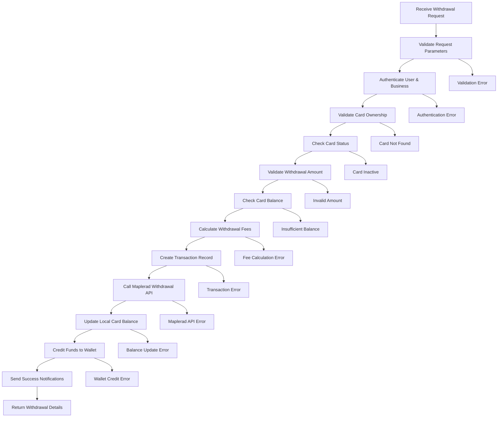

# Maplerad Card Withdrawal Process

## Overview

The card withdrawal process allows customers to transfer funds from their virtual cards back to their company wallet. This process involves balance validation, fee calculation, fund transfer from card to wallet, and synchronization with Maplerad's systems. The process ensures secure fund transfers while maintaining accurate balance tracking and regulatory compliance.

## Endpoint Details

- **HTTP Method**: `POST`
- **Route**: `/maplerad/cards/:cardId/withdraw`
- **Authentication**: Required (Business Owner)
- **Service**: `CardTransactionService.withdrawCard()`

## Process Flow Diagram



## Detailed Process Steps

### 1. Request Validation

**Purpose**: Ensure withdrawal request parameters are valid and complete.

**Validation Rules**:

- `cardId`: Must be a valid UUID and exist in database
- `amount`: Must be a positive number (2-1000 USD)
- Card must belong to authenticated business
- Card must be active and not terminated

**Parameter Validation**:

```typescript
if (!cardId || !amount || amount < 2) {
  throw new Error("Invalid withdrawal parameters");
}
```

### 2. User Authentication & Business Verification

**Purpose**: Ensure only authorized business owners can withdraw from cards.

**Authentication Process**:

- JWT token validation
- User existence and status check
- Business ownership verification
- Card ownership validation (card belongs to business customer)

**Security Checks**:

```typescript
// Verify business owns the card's customer
const card = await CardModel.getOne({ id: cardId });
if (card.customer.company_id !== business.id) {
  throw new Error("Unauthorized access to card");
}
```

### 3. Card Validation

**Purpose**: Ensure the card is eligible for withdrawal.

**Card Status Checks**:

- Card exists in database
- Card belongs to requesting business
- Card is active (`status = 'ACTIVE'`)
- Card is not frozen or terminated
- Card provider is Maplerad

**Card Validation Logic**:

```typescript
const cardResult = await CardModel.getOne({ id: cardId });
if (!cardResult.output) {
  throw new Error("Card not found");
}

const card = cardResult.output;
if (card.status !== "ACTIVE" || card.provider !== "maplerad") {
  throw new Error("Card not eligible for withdrawal");
}
```

### 4. Amount Validation

**Purpose**: Ensure withdrawal amount meets business rules.

**Amount Limits**:

- Minimum: 2 USD
- Maximum: 1000 USD (configurable)
- Must be positive number
- Must leave at least 1 USD balance on card

**Business Rules**:

```typescript
const MIN_AMOUNT = 2;
const MAX_AMOUNT = 1000;

if (amount < MIN_AMOUNT) {
  throw new Error(`Minimum withdrawal amount is ${MIN_AMOUNT} USD`);
}

if (amount > MAX_AMOUNT) {
  throw new Error(`Maximum withdrawal amount is ${MAX_AMOUNT} USD`);
}

// Ensure card keeps minimum balance
if (card.balance - amount < 1) {
  throw new Error("Card must maintain minimum balance of 1 USD");
}
```

### 5. Card Balance Verification

**Purpose**: Ensure card has sufficient funds for withdrawal.

**Balance Check Process**:

1. Retrieve current card balance
2. Calculate amount after withdrawal
3. Verify minimum balance requirement (1 USD)
4. Account for withdrawal fees

**Balance Validation**:

```typescript
const currentBalance = card.balance || 0;
const minimumBalance = 1; // USD
const requiredBalance = amount + minimumBalance;

if (currentBalance < requiredBalance) {
  throw new Error(
    `Insufficient card balance. Required: ${requiredBalance} USD, Available: ${currentBalance} USD`
  );
}
```

### 6. Fee Calculation

**Purpose**: Calculate all applicable fees for the withdrawal transaction.

**Fee Components**:

- **Withdrawal Fee**: Percentage-based fee on transaction amount
- **Fixed Fee**: Additional fixed charge (if applicable)
- **Processing Fee**: Card provider processing fees

**Fee Calculation Process**:

```typescript
const withdrawalFees = 0.1; // 10% fee
const feeAmount = amount * withdrawalFees;
const netAmount = amount - feeAmount;
```

**Fee Structure**:

- Base withdrawal fee: Configurable percentage (e.g., 10%)
- Net amount received = Withdrawal amount - Fee
- Fee deducted from withdrawal amount

### 7. Transaction Record Creation

**Purpose**: Create audit trail before API call for tracking and rollback.

**Transaction Data Structure**:

```typescript
const transactionData = {
  id: transactionId,
  status: "PENDING",
  amount: amount,
  fee_amount: feeAmount,
  category: "card",
  type: "withdrawal",
  customer_id: card.customer_id,
  card_id: cardId,
  company_id: business.id,
  provider: "maplerad",
  currency: "USD",
  reference: `WITHDRAW_${Date.now()}`,
  description: `Withdraw from card ${card.masked_number}`,
  created_at: new Date(),
};
```

**Transaction States**:

- `PENDING`: Initial state, transaction initiated
- `SUCCESS`: Transaction completed successfully
- `FAILED`: Transaction failed, no funds moved

### 8. Maplerad Withdrawal API Call

**Purpose**: Transfer funds from the card through Maplerad's API.

**API Request Structure**:

```typescript
const withdrawalRequest = {
  card_id: card.provider_card_id,
  amount: Math.round(amount * 100), // Convert to cents
  currency: "USD",
  reference: transactionId,
};
```

**API Response Handling**:

- **Success**: Funds withdrawn from card
- **Pending**: Transaction in progress, wait for webhook
- **Failed**: Transaction failed, rollback local changes

**Error Handling**:

```typescript
try {
  const response = await mapleradUtils.withdrawFromCard(withdrawalRequest);
  if (response.error) {
    throw new Error("Maplerad withdrawal failed");
  }
} catch (error) {
  // Mark transaction as failed
  await TransactionModel.update(transactionId, { status: "FAILED" });
  throw error;
}
```

### 9. Local Balance Updates

**Purpose**: Update card balance in local database.

**Balance Update Process**:

```typescript
const newBalance = card.balance - amount;
await CardModel.update(cardId, {
  balance: newBalance,
  updated_at: new Date(),
});
```

**Balance Tracking**:

- Previous balance recorded
- New balance calculated
- Withdrawal amount deducted
- Update timestamp recorded

### 10. Wallet Credit

**Purpose**: Add withdrawn funds to company wallet.

**Wallet Credit Process**:

```typescript
const walletId = business.wallet_id || business.id;
await UserModel.update(walletId, {
  balance_xaf: currentBalance + netAmount * exchangeRate,
});
```

**Amount Calculation**:

- Gross withdrawal amount from card
- Fee deduction
- Net amount credited to wallet
- Currency conversion if needed

### 11. Transaction Status Update

**Purpose**: Mark transaction as completed in audit trail.

**Status Update**:

```typescript
await TransactionModel.update(transactionId, {
  status: "SUCCESS",
  order_id: mapleradReference,
  card_new_balance_usd: newCardBalance,
  updated_at: new Date(),
});
```

### 12. Success Notifications

**Purpose**: Inform stakeholders of successful withdrawal.

**Notification Types**:

1. **Database Notification**: Stored for customer
2. **Email Notification**: Sent to company
3. **Push Notification**: Mobile notification (if enabled)

**Notification Content**:

```typescript
const notificationData = {
  customerId: card.customer_id,
  companyId: business.id,
  cardId: cardId,
  amount: netAmount,
  currency: "USD",
  reference: transactionId,
  message: `Withdrew ${amount} USD from card, received ${netAmount} USD`,
};
```

## Error Handling & Recovery

### Automatic Recovery Scenarios

1. **Maplerad API Failure**:

   - Transaction marked as failed
   - No funds moved
   - Customer notified of failure

2. **Database Error**:

   - Transaction rolled back
   - No balance changes committed
   - Error logged for investigation

3. **Insufficient Balance**:
   - Transaction rejected before API call
   - Clear error message provided
   - No partial transactions

### Error Response Format

```json
{
  "statusCode": 400,
  "message": "Card withdrawal failed",
  "error": {
    "code": "WITHDRAWAL_FAILED",
    "details": "Insufficient card balance",
    "required": 3,
    "available": 2
  }
}
```

## Security Considerations

### Fund Protection

- **Balance Validation**: Pre-check prevents overdrafts
- **Atomic Operations**: All-or-nothing transaction approach
- **Audit Trail**: Complete transaction logging
- **Minimum Balance**: Prevents complete fund depletion

### Access Control

- **Business Verification**: Only business owners can withdraw
- **Card Ownership**: Cards can only be accessed by owning business
- **Amount Limits**: Configurable limits prevent abuse
- **Rate Limiting**: API rate limiting on withdrawal requests

### Data Integrity

- **Transaction Logging**: Complete audit trail for all operations
- **Balance Consistency**: Card and wallet balances always reconciled
- **Rollback Capability**: Failed transactions fully reversible

## Performance Optimizations

### Caching Strategies

- **Balance Caching**: Cache card and wallet balances
- **Fee Caching**: Cache withdrawal fee structures
- **Exchange Rate Caching**: Cache currency conversion rates

### Asynchronous Processing

- **Notification Queue**: Non-blocking notifications
- **Email Queue**: Background email processing
- **Webhook Handling**: Asynchronous webhook processing

### Database Optimizations

- **Indexed Queries**: Fast card and customer lookups
- **Batch Updates**: Efficient balance updates
- **Connection Pooling**: Optimized database connections

## Business Rules & Compliance

### Withdrawal Limits

- **Daily Limits**: Maximum withdrawal per day per card
- **Monthly Limits**: Maximum withdrawal per month per customer
- **Single Transaction Limit**: Maximum amount per withdrawal
- **Minimum Balance**: Required balance left on card

### Regulatory Compliance

- **Transaction Monitoring**: Suspicious activity detection
- **AML Checks**: Anti-money laundering validation
- **Reporting Requirements**: Regulatory reporting compliance
- **Audit Requirements**: Complete transaction audit trails

### Business Rules

- **Fee Structure**: Transparent fee calculation and deduction
- **Balance Requirements**: Minimum balance maintenance
- **Processing Time**: Real-time processing with instant confirmation
- **Reversibility**: Clear refund policies for failed transactions

## Monitoring & Analytics

### Key Metrics

- **Withdrawal Success Rate**: Percentage of successful withdrawals
- **Average Processing Time**: Time from request to completion
- **Error Rate by Type**: Breakdown of failure reasons
- **Withdrawal Volume**: Total amount withdrawn over time

### Business Intelligence

- **Popular Withdrawal Amounts**: Most common withdrawal amounts
- **Geographic Distribution**: Withdrawal patterns by region
- **Time-based Patterns**: Peak withdrawal hours/days
- **Customer Segmentation**: Withdrawal behavior by customer type

## Future Enhancements

### Planned Features

1. **Bulk Withdrawals**: Withdraw from multiple cards simultaneously
2. **Scheduled Withdrawals**: Automated recurring withdrawals
3. **Partial Withdrawals**: Withdraw specific amounts with balance control
4. **Advanced Analytics**: Detailed withdrawal insights

### Technical Improvements

1. **Real-time Processing**: Instant withdrawal confirmation
2. **Enhanced Security**: Multi-factor authentication
3. **Mobile Optimization**: Improved mobile experience
4. **API Rate Limiting**: Advanced rate limiting

---

## API Response Examples

### Success Response

```json
{
  "status": "success",
  "message": "Withdrew 50 USD from card",
  "data": {
    "transactionId": "txn_1234567890",
    "amount": 50,
    "fee": 5,
    "netAmount": 45,
    "cardBalance": 25,
    "reference": "WITHDRAW_1234567890"
  }
}
```

### Error Response

```json
{
  "statusCode": 400,
  "message": "Insufficient card balance",
  "error": {
    "code": "INSUFFICIENT_BALANCE",
    "details": "Card must maintain minimum balance of 1 USD",
    "required": 51,
    "available": 50
  }
}
```

### Webhook Response

```json
{
  "event": "issuing.transaction",
  "type": "WITHDRAWAL",
  "card_id": "card_12345",
  "amount": 5000,
  "currency": "USD",
  "status": "SUCCESS",
  "reference": "txn_1234567890"
}
```

This comprehensive withdrawal process ensures secure, efficient, and reliable fund transfers from cards to wallets while maintaining complete audit trails and regulatory compliance.
