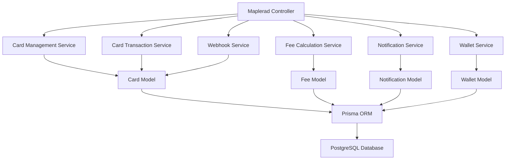
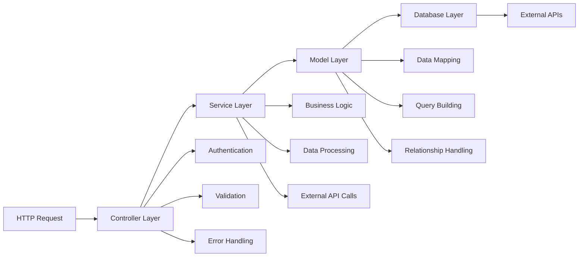
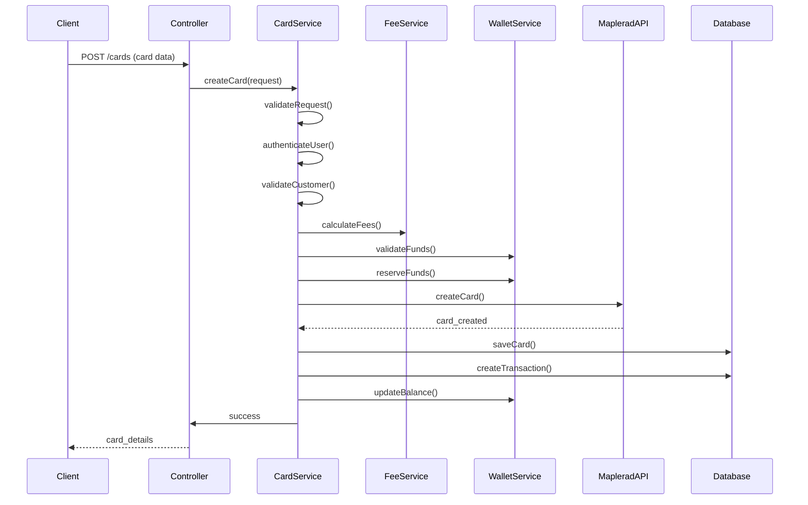
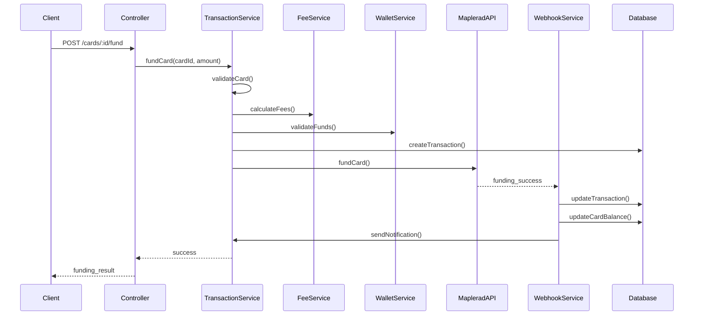

# Maplerad API Overview & Architecture

## Overview

The Maplerad API provides a comprehensive suite of endpoints for managing virtual card operations through the Maplerad payment platform. This documentation covers the complete API architecture, including all endpoints, their relationships, authentication mechanisms, and integration patterns.

## API Architecture

### Core Components



### Service Layer Architecture



## API Endpoints

### Card Management Endpoints

| Endpoint                                   | Method | Purpose                   | Service                                            |
| ------------------------------------------ | ------ | ------------------------- | -------------------------------------------------- |
| `POST /maplerad/cards`                     | POST   | Create new virtual card   | `CardManagementService.createCard()`               |
| `GET /maplerad/cards/customer/:customerId` | GET    | Get all customer cards    | `CardManagementService.getCustomerCardsWithSync()` |
| `GET /maplerad/cards/:cardId`              | GET    | Get specific card details | `CardManagementService.getCardDetails()`           |
| `PATCH /maplerad/cards/:cardId/status`     | PATCH  | Toggle card status        | `CardManagementService.toggleCardStatus()`         |
| `DELETE /maplerad/cards/:cardId/terminate` | DELETE | Terminate card            | `CardManagementService.terminateCard()`            |
| `PATCH /maplerad/cards/:cardId/hide`       | PATCH  | Hide card from list       | `CardManagementService.hideCard()`                 |

### Card Transaction Endpoints

| Endpoint                                   | Method | Purpose               | Service                                        |
| ------------------------------------------ | ------ | --------------------- | ---------------------------------------------- |
| `POST /maplerad/cards/:cardId/fund`        | POST   | Fund card with money  | `CardTransactionService.fundCard()`            |
| `POST /maplerad/cards/:cardId/withdraw`    | POST   | Withdraw from card    | `CardTransactionService.withdrawCard()`        |
| `GET /maplerad/cards/:cardId/transactions` | GET    | Get card transactions | `CardTransactionService.getCardTransactions()` |

### Webhook Endpoints

| Endpoint                  | Method | Purpose                   | Service                           |
| ------------------------- | ------ | ------------------------- | --------------------------------- |
| `POST /maplerad/webhooks` | POST   | Process Maplerad webhooks | `WebhookService.processWebhook()` |

## Authentication & Authorization

### Authentication Methods

#### JWT Token Authentication

```typescript
// Header format
Authorization: Bearer <jwt_token>

// Token payload structure
{
  "userId": "user_12345",
  "companyId": "comp_67890",
  "role": "business_owner",
  "permissions": ["card.create", "card.manage"],
  "iat": 1640995200,
  "exp": 1641081600
}
```

#### Business Ownership Verification

```typescript
// Verify user owns the business
const user = await UserModel.getOne({ id: userId });
if (user.company_id !== businessId) {
  throw new Error("Unauthorized business access");
}

// Verify business owns the customer
const customer = await CustomerModel.getOne({ id: customerId });
if (customer.company_id !== businessId) {
  throw new Error("Unauthorized customer access");
}
```

### Permission Matrix

| Role           | Card Creation | Card Funding | Card Withdrawal | Card Management | Webhook Access |
| -------------- | ------------- | ------------ | --------------- | --------------- | -------------- |
| Business Owner | ✅            | ✅           | ✅              | ✅              | ✅             |
| Customer       | ❌            | ❌           | ❌              | ❌              | ❌             |
| Admin          | ✅            | ✅           | ✅              | ✅              | ✅             |

## Data Models

### Core Entities

#### Card Model

```typescript
interface Card {
  id: string;
  customer_id: string;
  company_id: string;
  provider: "maplerad";
  provider_card_id: string;
  status: "ACTIVE" | "FROZEN" | "TERMINATED";
  balance: Decimal;
  currency: "USD";
  masked_number: string;
  name: string;
  brand: "VISA" | "MASTERCARD";
  expiry_month: number;
  expiry_year: number;
  is_active: boolean;
  is_virtual: boolean;
  created_at: Date;
  updated_at: Date;
}
```

#### Transaction Model

```typescript
interface Transaction {
  id: string;
  customer_id: string;
  company_id: string;
  card_id?: string;
  wallet_id?: string;
  type: "purchase" | "topup" | "withdrawal";
  category: "card";
  status: "PENDING" | "SUCCESS" | "FAILED";
  amount: Decimal;
  fee_amount: Decimal;
  net_amount: Decimal;
  currency: "USD";
  reference: string;
  description: string;
  created_at: Date;
  updated_at: Date;
}
```

#### Customer Model

```typescript
interface Customer {
  id: string;
  company_id: string;
  first_name: string;
  last_name: string;
  email: string;
  phone_number: string;
  date_of_birth: Date;
  country: string;
  country_iso_code: "CD" | "CM" | "GA";
  is_active: boolean;
  created_at: Date;
  updated_at: Date;
}
```

## Business Logic Flow

### Card Creation Flow



### Card Funding Flow



## Error Handling

### Error Classification

#### Client Errors (4xx)

```typescript
// Bad Request - Invalid parameters
{
  statusCode: 400,
  message: "Invalid card creation parameters",
  error: {
    code: "VALIDATION_ERROR",
    details: "Card brand must be VISA or MASTERCARD"
  }
}

// Unauthorized - Authentication failed
{
  statusCode: 401,
  message: "Authentication required",
  error: {
    code: "AUTHENTICATION_FAILED",
    details: "Invalid or expired JWT token"
  }
}

// Forbidden - Authorization failed
{
  statusCode: 403,
  message: "Access denied",
  error: {
    code: "AUTHORIZATION_FAILED",
    details: "User does not own this customer"
  }
}

// Not Found - Resource doesn't exist
{
  statusCode: 404,
  message: "Card not found",
  error: {
    code: "CARD_NOT_FOUND",
    details: "The specified card does not exist"
  }
}
```

#### Server Errors (5xx)

```typescript
// Internal Server Error
{
  statusCode: 500,
  message: "Internal server error",
  error: {
    code: "INTERNAL_ERROR",
    details: "Unexpected error occurred",
    reference: "ERR_1234567890"
  }
}

// Bad Gateway - External API error
{
  statusCode: 502,
  message: "External service unavailable",
  error: {
    code: "EXTERNAL_API_ERROR",
    details: "Maplerad API is currently unavailable"
  }
}
```

### Error Recovery Strategies

#### Automatic Retry

```typescript
const retryConfig = {
  maxRetries: 3,
  baseDelay: 1000, // 1 second
  maxDelay: 10000, // 10 seconds
  backoffFactor: 2,
};

// Retry logic for transient errors
async function retryOperation(operation, config) {
  let lastError;

  for (let attempt = 1; attempt <= config.maxRetries; attempt++) {
    try {
      return await operation();
    } catch (error) {
      lastError = error;

      if (!isRetryableError(error) || attempt === config.maxRetries) {
        throw error;
      }

      const delay = Math.min(
        config.baseDelay * Math.pow(config.backoffFactor, attempt - 1),
        config.maxDelay
      );

      await sleep(delay);
    }
  }

  throw lastError;
}
```

#### Circuit Breaker Pattern

```typescript
class CircuitBreaker {
  constructor(failureThreshold = 5, recoveryTimeout = 60000) {
    this.failureThreshold = failureThreshold;
    this.recoveryTimeout = recoveryTimeout;
    this.failureCount = 0;
    this.state = "CLOSED"; // CLOSED, OPEN, HALF_OPEN
    this.nextAttemptTime = 0;
  }

  async execute(operation) {
    if (this.state === "OPEN") {
      if (Date.now() < this.nextAttemptTime) {
        throw new Error("Circuit breaker is OPEN");
      }
      this.state = "HALF_OPEN";
    }

    try {
      const result = await operation();
      this.onSuccess();
      return result;
    } catch (error) {
      this.onFailure();
      throw error;
    }
  }

  onSuccess() {
    this.failureCount = 0;
    this.state = "CLOSED";
  }

  onFailure() {
    this.failureCount++;
    if (this.failureCount >= this.failureThreshold) {
      this.state = "OPEN";
      this.nextAttemptTime = Date.now() + this.recoveryTimeout;
    }
  }
}
```

## Performance Optimization

### Caching Strategy

#### Multi-Level Caching

```typescript
// L1: In-memory cache (fastest)
const memoryCache = new Map();

// L2: Redis cache (distributed)
const redisCache = new Redis();

// L3: Database cache (persistent)
const dbCache = new Map();

class CacheManager {
  async get(key, fetcher, ttl = 300) {
    // Try L1 cache first
    let data = memoryCache.get(key);
    if (data && !this.isExpired(data.timestamp, ttl)) {
      return data.value;
    }

    // Try L2 cache
    data = await redisCache.get(key);
    if (data) {
      memoryCache.set(key, { value: data, timestamp: Date.now() });
      return data;
    }

    // Fetch from source
    const freshData = await fetcher();

    // Cache in all levels
    const cacheEntry = { value: freshData, timestamp: Date.now() };
    memoryCache.set(key, cacheEntry);
    await redisCache.setex(key, ttl, freshData);

    return freshData;
  }

  invalidate(pattern) {
    // Invalidate memory cache
    for (const [key] of memoryCache) {
      if (key.includes(pattern)) {
        memoryCache.delete(key);
      }
    }

    // Invalidate Redis cache
    // Implementation depends on Redis version
  }
}
```

#### Database Optimization

```typescript
// Optimized queries with proper indexing
const cardQueries = {
  // Get customer cards with pagination
  getCustomerCards: `
    SELECT c.*, cust.first_name, cust.last_name
    FROM cards c
    JOIN customers cust ON c.customer_id = cust.id
    WHERE c.customer_id = $1
      AND c.provider = 'maplerad'
      AND c.is_active = true
      AND c.status != 'TERMINATED'
    ORDER BY c.created_at DESC
    LIMIT $2 OFFSET $3
  `,

  // Get card with transaction summary
  getCardWithSummary: `
    SELECT
      c.*,
      COALESCE(SUM(CASE WHEN t.type = 'topup' THEN t.amount END), 0) as total_funded,
      COALESCE(SUM(CASE WHEN t.type = 'withdrawal' THEN t.amount END), 0) as total_withdrawn,
      COUNT(t.id) as transaction_count
    FROM cards c
    LEFT JOIN transactions t ON c.id = t.card_id AND t.status = 'SUCCESS'
    WHERE c.id = $1
    GROUP BY c.id
  `,
};

// Connection pooling
const poolConfig = {
  min: 2,
  max: 10,
  idleTimeoutMillis: 30000,
  connectionTimeoutMillis: 2000,
};
```

### Asynchronous Processing

#### Queue-Based Architecture

```typescript
// Notification queue
class NotificationQueue {
  constructor() {
    this.queue = [];
    this.processing = false;
    this.maxConcurrency = 5;
  }

  async add(notification) {
    this.queue.push(notification);
    await this.process();
  }

  async process() {
    if (this.processing || this.queue.length === 0) {
      return;
    }

    this.processing = true;

    while (this.queue.length > 0) {
      const batch = this.queue.splice(0, this.maxConcurrency);

      await Promise.all(
        batch.map((notification) => this.sendNotification(notification))
      );
    }

    this.processing = false;
  }

  async sendNotification(notification) {
    try {
      // Send email, push notification, etc.
      await notificationService.send(notification);
    } catch (error) {
      console.error("Notification failed:", error);
      // Retry logic or dead letter queue
    }
  }
}
```

## Monitoring & Observability

### Key Metrics

#### Business Metrics

- **Card Creation Rate**: Cards created per day/week
- **Funding Volume**: Total amount funded per period
- **Withdrawal Volume**: Total amount withdrawn per period
- **Active Cards**: Number of active cards
- **Customer Satisfaction**: Based on support tickets

#### Technical Metrics

- **API Response Time**: Average response time per endpoint
- **Error Rate**: Percentage of failed requests
- **Throughput**: Requests per second
- **Database Query Performance**: Slow query detection
- **Cache Hit Rate**: Cache effectiveness
- **Webhook Processing Time**: Time to process webhooks

### Logging Strategy

#### Structured Logging

```typescript
const logger = {
  info: (message, context = {}) => {
    console.log(
      JSON.stringify({
        level: "INFO",
        timestamp: new Date().toISOString(),
        message,
        ...context,
        service: "maplerad-api",
        version: process.env.npm_package_version,
      })
    );
  },

  error: (message, error, context = {}) => {
    console.error(
      JSON.stringify({
        level: "ERROR",
        timestamp: new Date().toISOString(),
        message,
        error: {
          name: error.name,
          message: error.message,
          stack: error.stack,
        },
        ...context,
        service: "maplerad-api",
      })
    );
  },

  performance: (operation, duration, context = {}) => {
    console.log(
      JSON.stringify({
        level: "PERFORMANCE",
        timestamp: new Date().toISOString(),
        operation,
        duration_ms: duration,
        ...context,
        service: "maplerad-api",
      })
    );
  },
};
```

#### Health Checks

```typescript
// Application health check
app.get("/health", async (req, res) => {
  const health = {
    status: "healthy",
    timestamp: new Date().toISOString(),
    version: process.env.npm_package_version,
    checks: {},
  };

  // Database health check
  try {
    await prisma.$queryRaw`SELECT 1`;
    health.checks.database = { status: "healthy" };
  } catch (error) {
    health.checks.database = { status: "unhealthy", error: error.message };
    health.status = "unhealthy";
  }

  // Redis health check
  try {
    await redis.ping();
    health.checks.redis = { status: "healthy" };
  } catch (error) {
    health.checks.redis = { status: "unhealthy", error: error.message };
    health.status = "degraded";
  }

  // Maplerad API health check
  try {
    await mapleradUtils.healthCheck();
    health.checks.maplerad = { status: "healthy" };
  } catch (error) {
    health.checks.maplerad = { status: "unhealthy", error: error.message };
    health.status = "degraded";
  }

  const statusCode =
    health.status === "healthy"
      ? 200
      : health.status === "degraded"
      ? 200
      : 503;

  res.status(statusCode).json(health);
});
```

## Security Considerations

### Data Protection

#### Encryption at Rest

```typescript
// Sensitive data encryption
const encrypt = (text) => {
  const cipher = crypto.createCipher("aes-256-gcm", ENCRYPTION_KEY);
  let encrypted = cipher.update(text, "utf8", "hex");
  encrypted += cipher.final("hex");
  const tag = cipher.getAuthTag();
  return encrypted + ":" + tag.toString("hex");
};

const decrypt = (encryptedText) => {
  const [encrypted, tag] = encryptedText.split(":");
  const decipher = crypto.createDecipher("aes-256-gcm", ENCRYPTION_KEY);
  decipher.setAuthTag(Buffer.from(tag, "hex"));
  let decrypted = decipher.update(encrypted, "hex", "utf8");
  decrypted += decipher.final("utf8");
  return decrypted;
};
```

#### API Security

```typescript
// Rate limiting
const rateLimit = require("express-rate-limit");
const limiter = rateLimit({
  windowMs: 15 * 60 * 1000, // 15 minutes
  max: 100, // limit each IP to 100 requests per windowMs
  message: "Too many requests from this IP, please try again later.",
  standardHeaders: true,
  legacyHeaders: false,
});

// CORS configuration
const corsOptions = {
  origin: process.env.ALLOWED_ORIGINS?.split(",") || ["http://localhost:3000"],
  credentials: true,
  methods: ["GET", "POST", "PUT", "DELETE", "PATCH"],
  allowedHeaders: ["Content-Type", "Authorization"],
};

// Helmet security headers
app.use(
  helmet({
    contentSecurityPolicy: {
      directives: {
        defaultSrc: ["'self'"],
        styleSrc: ["'self'", "'unsafe-inline'"],
        scriptSrc: ["'self'"],
        imgSrc: ["'self'", "data:", "https:"],
      },
    },
  })
);
```

### Compliance & Audit

#### Regulatory Compliance

- **PCI DSS**: Payment card industry data security standard
- **GDPR**: General data protection regulation
- **AML**: Anti-money laundering regulations
- **KYC**: Know your customer requirements

#### Audit Trail

```typescript
// Comprehensive audit logging
const auditLog = async (action, resource, user, changes) => {
  await AuditLog.create({
    id: uuidv4(),
    action,
    resource_type: resource.type,
    resource_id: resource.id,
    user_id: user.id,
    company_id: user.company_id,
    changes,
    ip_address: getClientIP(),
    user_agent: getUserAgent(),
    timestamp: new Date(),
  });
};
```

## Deployment & Scaling

### Containerization

```dockerfile
# Multi-stage Docker build
FROM node:18-alpine AS base
WORKDIR /app
COPY package*.json ./
RUN npm ci --only=production

FROM node:18-alpine AS build
WORKDIR /app
COPY . .
RUN npm run build

FROM node:18-alpine AS production
WORKDIR /app
COPY --from=base /app/node_modules ./node_modules
COPY --from=build /app/dist ./dist
COPY --from=build /app/package.json ./

EXPOSE 3000
CMD ["npm", "run", "start:prod"]
```

### Orchestration

```yaml
# Kubernetes deployment
apiVersion: apps/v1
kind: Deployment
metadata:
  name: maplerad-api
spec:
  replicas: 3
  selector:
    matchLabels:
      app: maplerad-api
  template:
    metadata:
      labels:
        app: maplerad-api
    spec:
      containers:
        - name: api
          image: maplerad-api:latest
          ports:
            - containerPort: 3000
          env:
            - name: NODE_ENV
              value: "production"
            - name: DATABASE_URL
              valueFrom:
                secretKeyRef:
                  name: db-secret
                  key: url
          resources:
            requests:
              memory: "256Mi"
              cpu: "250m"
            limits:
              memory: "512Mi"
              cpu: "500m"
          livenessProbe:
            httpGet:
              path: /health
              port: 3000
            initialDelaySeconds: 30
            periodSeconds: 10
          readinessProbe:
            httpGet:
              path: /health
              port: 3000
            initialDelaySeconds: 5
            periodSeconds: 5
```

### Scaling Strategies

#### Horizontal Scaling

- **Load Balancer**: Distribute traffic across instances
- **Session Affinity**: Sticky sessions for stateful operations
- **Database Sharding**: Scale database horizontally
- **Cache Distribution**: Distributed caching layer

#### Performance Optimization

- **CDN Integration**: Static asset delivery
- **API Gateway**: Request routing and throttling
- **Service Mesh**: Inter-service communication
- **Auto-scaling**: Scale based on metrics

## Future Enhancements

### Planned Features

1. **GraphQL API**: More flexible data fetching
2. **Real-time Updates**: WebSocket-based notifications
3. **Advanced Analytics**: Machine learning insights
4. **Multi-currency Support**: Additional currency handling
5. **Bulk Operations**: Batch card management
6. **Mobile SDK**: Native mobile integration

### Technical Improvements

1. **Microservices Migration**: Break down monolithic architecture
2. **Event Sourcing**: Complete event-driven architecture
3. **Advanced Caching**: Multi-level caching strategies
4. **AI/ML Integration**: Fraud detection and recommendations
5. **Blockchain Integration**: Enhanced security and transparency

---

## API Usage Examples

### Create Card

```bash
curl -X POST http://api.example.com/maplerad/cards \
  -H "Authorization: Bearer <jwt_token>" \
  -H "Content-Type: application/json" \
  -d '{
    "customerId": "cust_12345",
    "cardBrand": "VISA",
    "initialBalance": 100.00,
    "name": "John Doe"
  }'
```

### Fund Card

```bash
curl -X POST http://api.example.com/maplerad/cards/card_12345/fund \
  -H "Authorization: Bearer <jwt_token>" \
  -H "Content-Type: application/json" \
  -d '{
    "amount": 50.00
  }'
```

### Get Customer Cards

```bash
curl -X GET http://api.example.com/maplerad/cards/customer/cust_12345 \
  -H "Authorization: Bearer <jwt_token>"
```

This comprehensive API overview provides the foundation for understanding, implementing, and maintaining the Maplerad card management system with enterprise-grade reliability, security, and performance.
