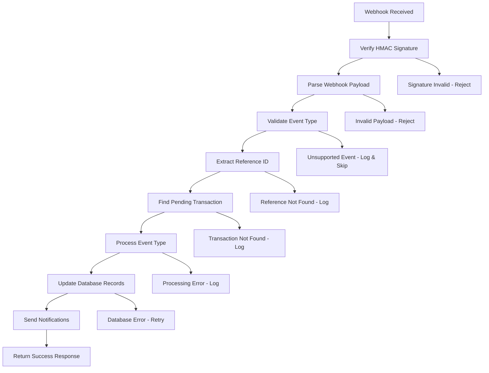

# Maplerad Webhook Processing System

## Overview

The webhook processing system handles asynchronous responses from Maplerad's API for card-related operations. This system ensures reliable processing of card creation, funding, and withdrawal confirmations while maintaining data consistency and providing real-time updates to customers and businesses.

## Webhook Endpoint Details

- **HTTP Method**: `POST`
- **Route**: `/maplerad/webhooks`
- **Authentication**: HMAC Signature Verification
- **Service**: `WebhookService.processWebhook()`

## Webhook Types & Events

### Supported Webhook Events

1. **Card Issuance Events**

   - `issuing.card.created` - Card successfully created
   - `issuing.card.failed` - Card creation failed
   - `issuing.card.activated` - Card activated

2. **Transaction Events**

   - `issuing.transaction.funding` - Card funding completed
   - `issuing.transaction.withdrawal` - Card withdrawal completed
   - `issuing.transaction.failed` - Transaction failed

3. **Card Status Events**
   - `issuing.card.frozen` - Card frozen
   - `issuing.card.unfrozen` - Card unfrozen
   - `issuing.card.terminated` - Card terminated

## Process Flow Diagram



## Detailed Process Steps

### 1. Webhook Signature Verification

**Purpose**: Ensure webhook authenticity and prevent spoofing attacks.

**HMAC Verification Process**:

```typescript
const signature = req.headers["x-maplerad-signature"];
const payload = JSON.stringify(req.body);
const expectedSignature = crypto
  .createHmac("sha256", WEBHOOK_SECRET)
  .update(payload)
  .digest("hex");

if (signature !== expectedSignature) {
  throw new Error("Invalid webhook signature");
}
```

**Security Measures**:

- HMAC-SHA256 signature verification
- Timestamp validation (prevent replay attacks)
- Request size limits
- Rate limiting per IP

### 2. Payload Parsing & Validation

**Purpose**: Extract and validate webhook data structure.

**Webhook Payload Structure**:

```json
{
  "event": "issuing.transaction",
  "type": "FUNDING",
  "data": {
    "card_id": "card_12345",
    "amount": 2500,
    "currency": "USD",
    "status": "SUCCESS",
    "reference": "txn_1234567890",
    "created_at": "2025-01-10T10:00:00Z"
  },
  "metadata": {
    "attempt": 1,
    "delivered_at": "2025-01-10T10:00:05Z"
  }
}
```

**Validation Rules**:

- Required fields presence
- Data type validation
- Amount format verification
- Reference ID format validation

### 3. Event Type Processing

**Purpose**: Route webhook to appropriate handler based on event type.

**Event Processing Logic**:

```typescript
switch (webhookData.event) {
  case "issuing.card.created":
    await processCardCreated(webhookData);
    break;
  case "issuing.transaction":
    await processTransactionEvent(webhookData);
    break;
  case "issuing.card.status_changed":
    await processCardStatusChange(webhookData);
    break;
  default:
    console.log(`Unsupported webhook event: ${webhookData.event}`);
}
```

### 4. Transaction Lookup & Validation

**Purpose**: Find the corresponding local transaction for webhook processing.

**Transaction Lookup Process**:

```typescript
const transaction = await TransactionModel.getOne({
  reference: webhookData.data.reference,
  status: "PENDING",
});

if (!transaction) {
  console.warn(
    `Transaction not found for reference: ${webhookData.data.reference}`
  );
  return;
}
```

**Validation Checks**:

- Transaction exists in database
- Transaction status is PENDING
- Transaction belongs to correct company
- Transaction amount matches webhook amount

### 5. Card Creation Webhook Processing

**Purpose**: Complete card creation process when Maplerad confirms card issuance.

**Processing Steps**:

1. Update card status to ACTIVE
2. Store Maplerad card ID
3. Update card balance
4. Mark transaction as SUCCESS
5. Send success notifications

**Database Updates**:

```typescript
// Update card record
await CardModel.update(cardId, {
  status: "ACTIVE",
  provider_card_id: webhookData.data.card_id,
  balance: webhookData.data.balance,
  updated_at: new Date(),
});

// Update transaction
await TransactionModel.update(transactionId, {
  status: "SUCCESS",
  order_id: webhookData.data.reference,
  updated_at: new Date(),
});
```

### 6. Funding Transaction Webhook Processing

**Purpose**: Confirm successful card funding and update balances.

**Processing Steps**:

1. Verify funding amount matches
2. Update card balance
3. Confirm wallet deduction
4. Mark transaction as SUCCESS
5. Send funding confirmation

**Balance Reconciliation**:

```typescript
const expectedAmount = transaction.amount;
const webhookAmount = webhookData.data.amount / 100; // Convert from cents

if (expectedAmount !== webhookAmount) {
  console.error("Amount mismatch in funding webhook");
  return;
}

// Update card balance
await CardModel.update(cardId, {
  balance: card.balance + webhookAmount,
  updated_at: new Date(),
});
```

### 7. Withdrawal Transaction Webhook Processing

**Purpose**: Confirm successful card withdrawal and credit wallet.

**Processing Steps**:

1. Verify withdrawal amount matches
2. Update card balance (deduct amount)
3. Credit company wallet with net amount
4. Mark transaction as SUCCESS
5. Send withdrawal confirmation

**Balance Updates**:

```typescript
// Update card balance (deduct full amount)
await CardModel.update(cardId, {
  balance: card.balance - webhookAmount,
  updated_at: new Date(),
});

// Credit wallet with net amount (after fees)
const netAmount = webhookAmount * (1 - WITHDRAWAL_FEE_RATE);
await UnifiedWalletService.updateBalance(walletId, netAmount);
```

### 8. Failure Event Processing

**Purpose**: Handle failed transactions and trigger rollback procedures.

**Failure Scenarios**:

- Card creation failure
- Funding failure
- Withdrawal failure
- System errors

**Rollback Process**:

```typescript
// For funding failures
if (webhookData.type === "FUNDING" && webhookData.status === "FAILED") {
  // Refund reserved funds
  await UnifiedWalletService.refundFunds(
    walletId,
    transaction.amount + transaction.fee_amount,
    transaction.reference
  );

  // Mark transaction as failed
  await TransactionModel.update(transactionId, {
    status: "FAILED",
    updated_at: new Date(),
  });
}
```

### 9. Notification System

**Purpose**: Send real-time notifications for webhook events.

**Notification Types**:

1. **Success Notifications**: Transaction completed successfully
2. **Failure Notifications**: Transaction failed with details
3. **Status Updates**: Card status changes

**Notification Content**:

```typescript
const notificationData = {
  customerId: transaction.customer_id,
  companyId: transaction.company_id,
  cardId: transaction.card_id,
  amount: webhookData.data.amount / 100,
  currency: webhookData.data.currency,
  status: webhookData.data.status,
  reference: webhookData.data.reference,
  event: webhookData.event,
};
```

### 10. Error Handling & Retry Logic

**Purpose**: Ensure reliable webhook processing with automatic retries.

**Error Handling Strategies**:

- **Transient Errors**: Automatic retry with exponential backoff
- **Permanent Errors**: Log and alert for manual intervention
- **Validation Errors**: Reject invalid webhooks immediately

**Retry Configuration**:

```typescript
const retryConfig = {
  maxRetries: 3,
  initialDelay: 1000, // 1 second
  maxDelay: 30000, // 30 seconds
  backoffMultiplier: 2,
};
```

## Security Considerations

### Webhook Security

- **HMAC Verification**: Cryptographic signature validation
- **Timestamp Validation**: Prevent replay attacks
- **IP Whitelisting**: Restrict webhook sources
- **Request Size Limits**: Prevent DoS attacks

### Data Protection

- **Encryption**: Sensitive data encrypted at rest
- **Access Control**: Webhook processing isolated from public APIs
- **Audit Logging**: Complete webhook processing logs
- **Rate Limiting**: Prevent webhook spam

## Reliability Features

### Idempotency Handling

**Purpose**: Prevent duplicate webhook processing.

**Idempotency Implementation**:

```typescript
const processedWebhook = await WebhookLogModel.getOne({
  webhook_id: webhookData.id,
  event: webhookData.event,
});

if (processedWebhook) {
  console.log("Webhook already processed");
  return { status: "already_processed" };
}

// Process webhook
await processWebhookEvent(webhookData);

// Log processed webhook
await WebhookLogModel.create({
  webhook_id: webhookData.id,
  event: webhookData.event,
  processed_at: new Date(),
  status: "processed",
});
```

### Dead Letter Queue

**Purpose**: Handle persistently failing webhooks.

**DLQ Process**:

1. Webhook fails maximum retry attempts
2. Moved to dead letter queue
3. Alert sent to development team
4. Manual processing capability
5. Failure analysis and resolution

### Monitoring & Alerting

**Purpose**: Monitor webhook health and performance.

**Key Metrics**:

- Webhook delivery success rate
- Processing time per event type
- Error rate by webhook type
- Queue depth and processing lag

**Alert Conditions**:

- High error rate (>5%)
- Processing delay (>5 minutes)
- Queue depth (>100 pending)
- Signature verification failures

## Performance Optimizations

### Processing Optimizations

- **Asynchronous Processing**: Non-blocking webhook handling
- **Batch Processing**: Group similar webhooks for efficiency
- **Connection Pooling**: Optimized database connections
- **Caching**: Cache frequently accessed data

### Scalability Features

- **Horizontal Scaling**: Multiple webhook processors
- **Load Balancing**: Distribute webhook load
- **Queue Partitioning**: Separate queues for different event types
- **Auto-scaling**: Scale based on webhook volume

## Business Rules & Compliance

### Regulatory Compliance

- **Transaction Monitoring**: Real-time suspicious activity detection
- **AML Compliance**: Anti-money laundering checks
- **Audit Trail**: Complete webhook processing logs
- **Data Retention**: Configurable log retention periods

### Business Continuity

- **Failover Handling**: Automatic failover to backup systems
- **Data Replication**: Cross-region data replication
- **Backup Systems**: Secondary webhook processing capability
- **Disaster Recovery**: Comprehensive recovery procedures

## Monitoring & Analytics

### Key Performance Indicators

- **Webhook Success Rate**: Percentage of successfully processed webhooks
- **Processing Latency**: Time from webhook receipt to completion
- **Error Rate by Type**: Breakdown of webhook processing errors
- **Throughput**: Number of webhooks processed per minute

### Business Intelligence

- **Event Type Distribution**: Most common webhook events
- **Geographic Distribution**: Webhook processing by region
- **Time-based Patterns**: Peak webhook processing times
- **Failure Analysis**: Root cause analysis of webhook failures

## Future Enhancements

### Planned Features

1. **Webhook Replay**: Ability to replay missed webhooks
2. **Custom Webhook Filters**: Configurable webhook event filtering
3. **Webhook Analytics Dashboard**: Real-time webhook monitoring
4. **Advanced Retry Logic**: Machine learning-based retry strategies

### Technical Improvements

1. **Event Streaming**: Real-time webhook event streaming
2. **Webhook Versioning**: Support for multiple webhook versions
3. **Enhanced Security**: Advanced threat detection
4. **Performance Monitoring**: Detailed performance metrics

---

## Webhook Examples

### Card Creation Success Webhook

```json
{
  "event": "issuing.card.created",
  "type": "CARD_CREATION",
  "data": {
    "card_id": "card_12345",
    "customer_id": "cust_67890",
    "status": "ACTIVE",
    "balance": 10000,
    "currency": "USD",
    "masked_number": "411111****1111",
    "reference": "CARD_1234567890"
  },
  "metadata": {
    "attempt": 1,
    "delivered_at": "2025-01-10T10:00:00Z"
  }
}
```

### Funding Success Webhook

```json
{
  "event": "issuing.transaction",
  "type": "FUNDING",
  "data": {
    "card_id": "card_12345",
    "amount": 2500,
    "currency": "USD",
    "status": "SUCCESS",
    "reference": "FUND_1234567890",
    "fee": 63
  },
  "metadata": {
    "attempt": 1,
    "delivered_at": "2025-01-10T10:05:00Z"
  }
}
```

### Transaction Failure Webhook

```json
{
  "event": "issuing.transaction",
  "type": "WITHDRAWAL",
  "data": {
    "card_id": "card_12345",
    "amount": 5000,
    "currency": "USD",
    "status": "FAILED",
    "reference": "WITHDRAW_1234567890",
    "error_code": "INSUFFICIENT_FUNDS",
    "error_message": "Card balance insufficient"
  },
  "metadata": {
    "attempt": 1,
    "delivered_at": "2025-01-10T10:10:00Z"
  }
}
```

This comprehensive webhook processing system ensures reliable, secure, and efficient handling of all Maplerad asynchronous events while maintaining data consistency and providing real-time updates.
